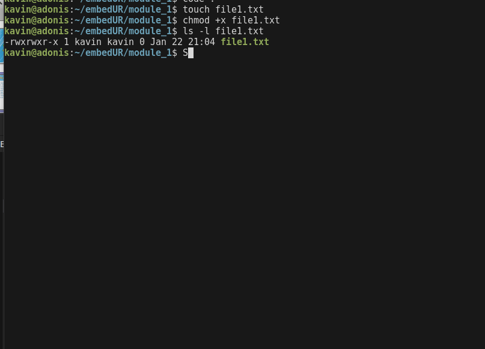
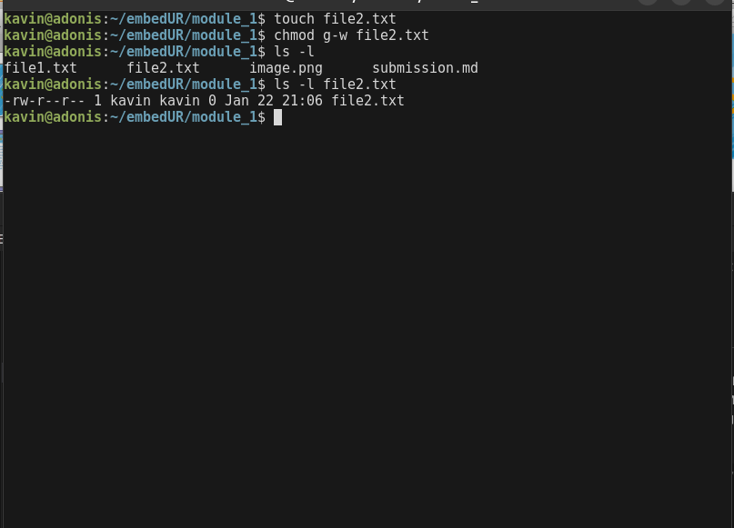
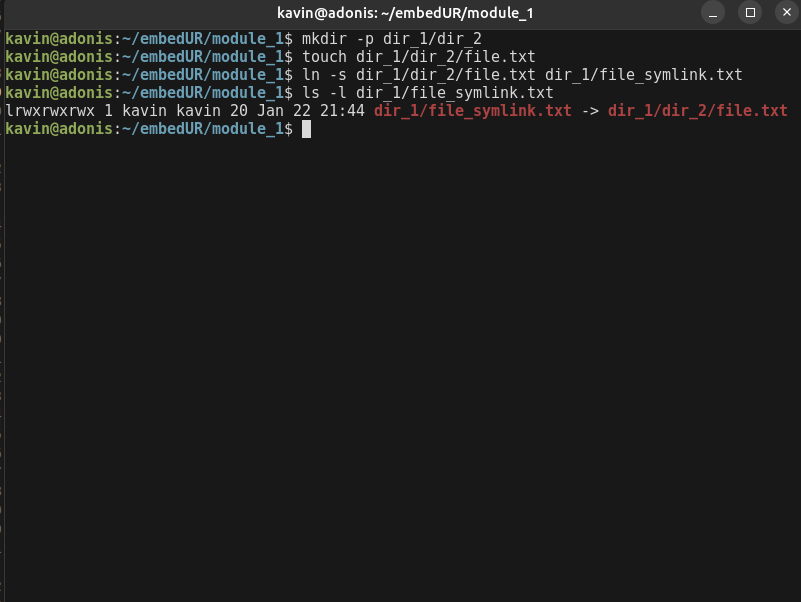
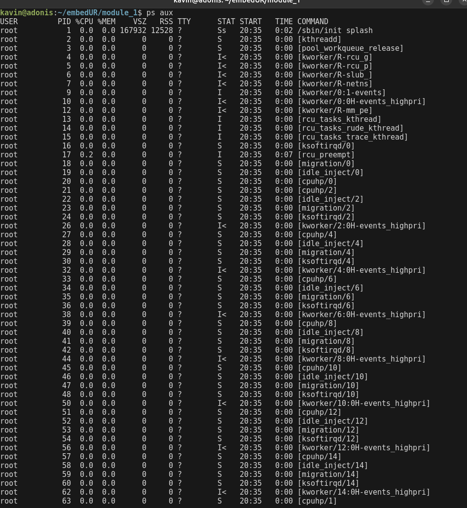
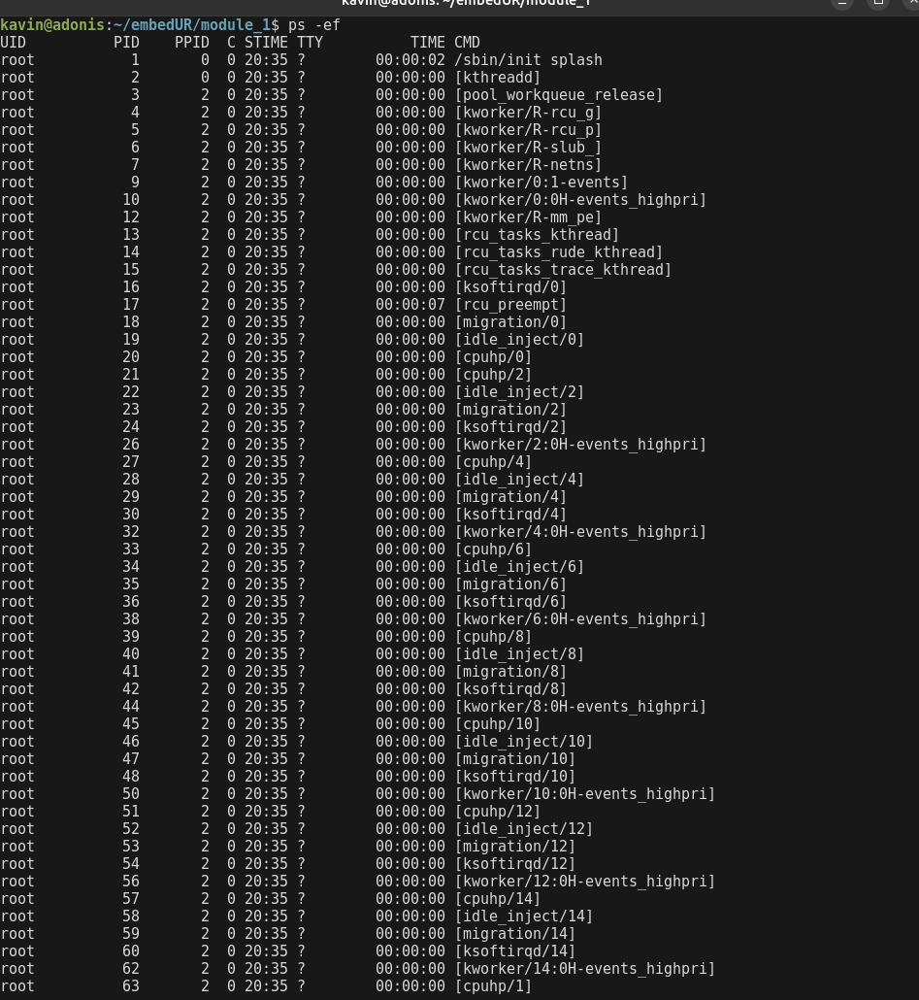
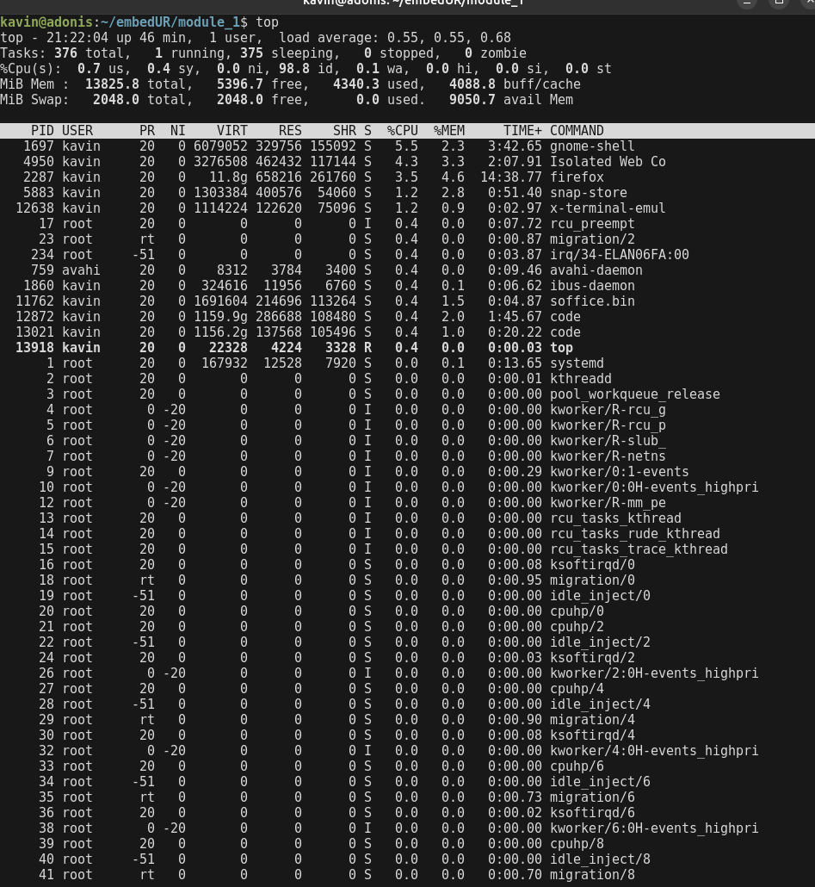
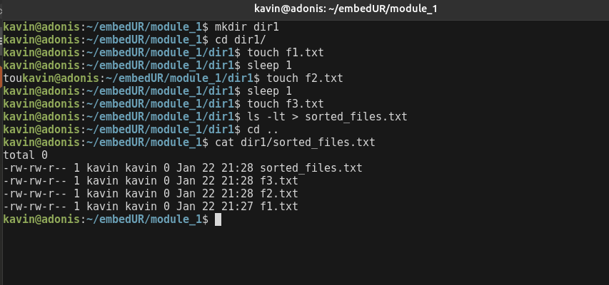

## Module 1

### 1. Create a file and add executable permission to all users (user, group, and others)




```bash
#Alternatively we can also use octal notiona to achieve the same by using the below command

chmod 111 file1.txt

```
#
### 2. Create a file and remove write permission for the group user alone



```bash
#Alternatively we can also use octal notiona to achieve the same by using the below command

chmod 757 file1.txt

```
- Here rw-r--r-- indicates that the group no longer has write permissions.

- Where
    - `rw-` for user
    - `r--` for group
#
### 3. Create a file and add a softlink to the file in a different directory


- the `l` at the begining of the output means that there is a softlink pointing to `dir1/dir2/file.txt`
#
### 4. Use the ps command with options to display all active processes running on the system

- The `ps aux` command shows
    - `a` for all process with terminals 
    - `u` for user oriented formate
    - `x` for all process without a terminal.



- The `ps -ef` command is also used to see the process hierachy



- `top` is used for a more dynamic view of the processes.


#

### 5. Create 3 files in a directory dir1 and redirect the output of the ls command sorted by timestamp of the files to a file




- The `ls -lt` command sorts files by timestamp (-t) in long format. 
- The `>` operator redirects the output to a new file called sorted_files.txt.