## Networking Module Week 1 & 2 Assignment Solutions

### Environment Configuration:

- Ubuntu Server VM: kavin@192.168.31.63
- Host System: 192.168.31.241

## 

### 1. Consider a case, a folder has multiple files and how would copy it to destination machine path (Try using SCP, cp options in Linux)

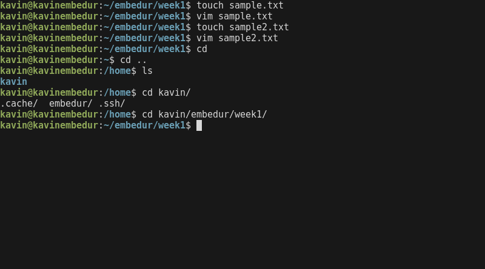
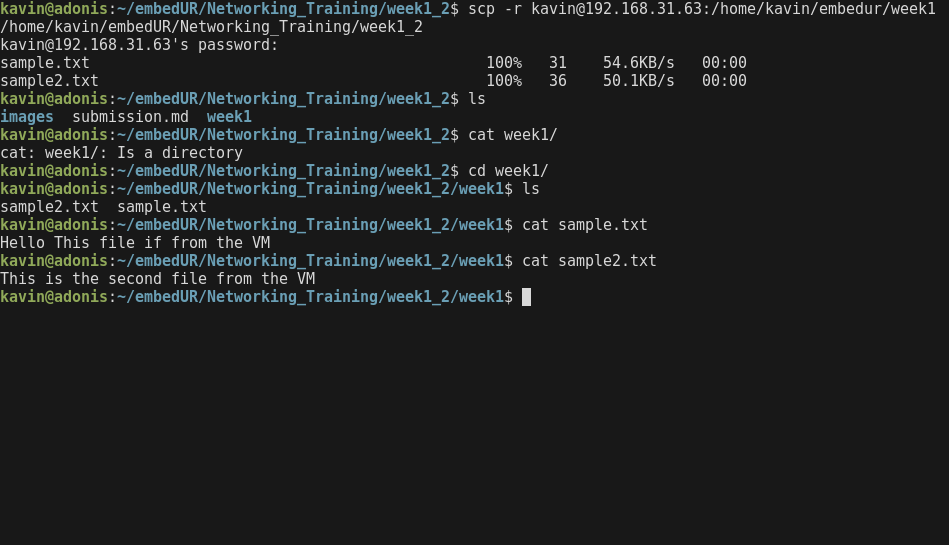

-   The -r flag enables recursive copying to include all subdirectories
##

### 2. Host a FTP and SFTP server and try PUT and GET operations.

- Here I'm using vsftpd ftp service +
- Setting up the FTP host in the VM 

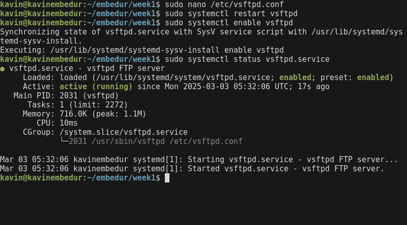

- Connecting to the FTP server from the host

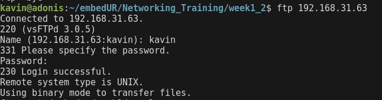

- using put and get for file transver 

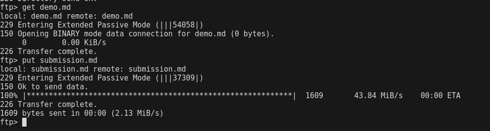

- The same using the sftp protocol

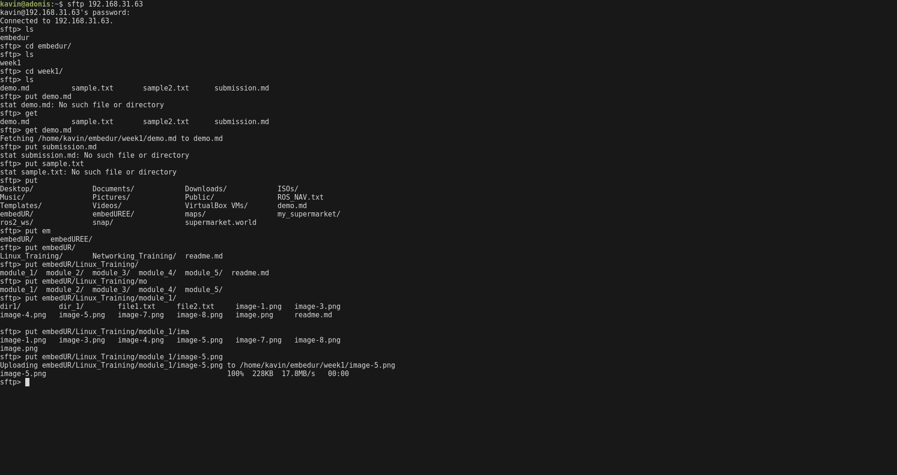
##

### 3. Explore with Wireshark/TCP-dump/cisco packet tracer tools and learn about packets filters.
- Packet tracing with ip address
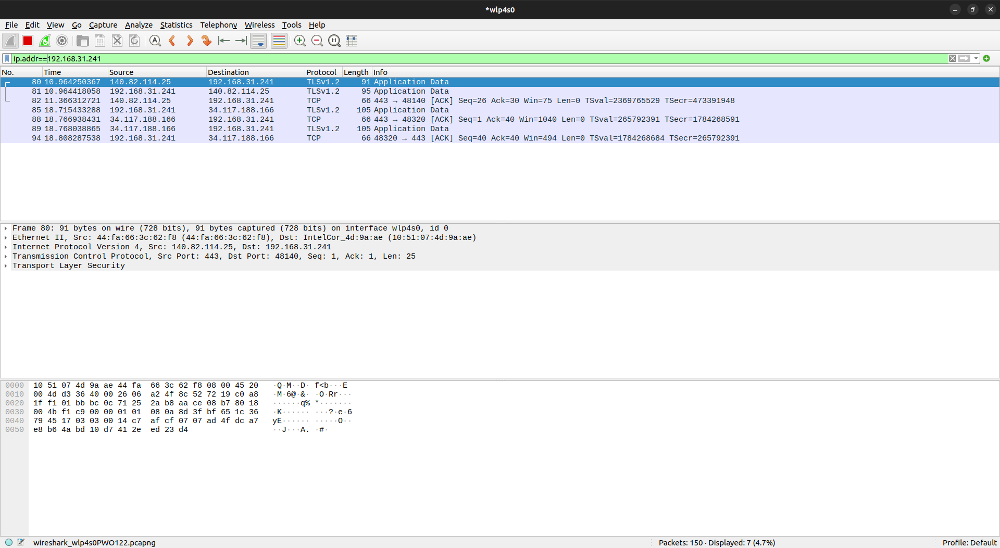

- Packet tracing with protocol names
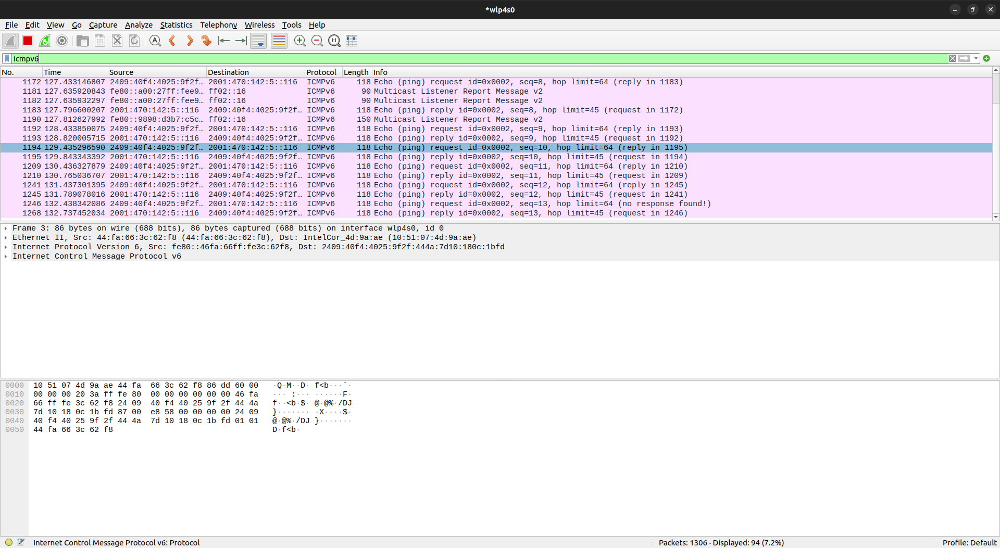

- Packet tracing with port numbers
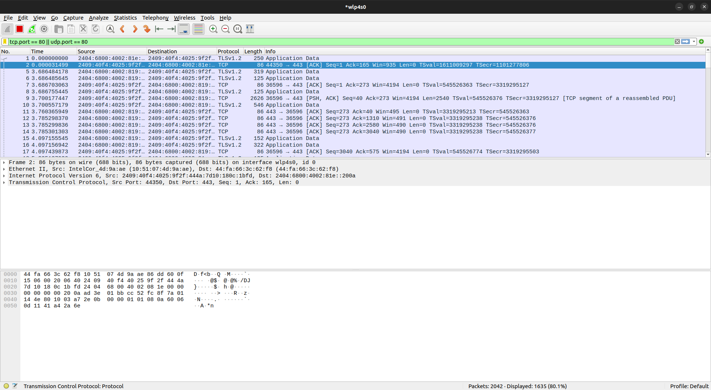

- Using tcpdump
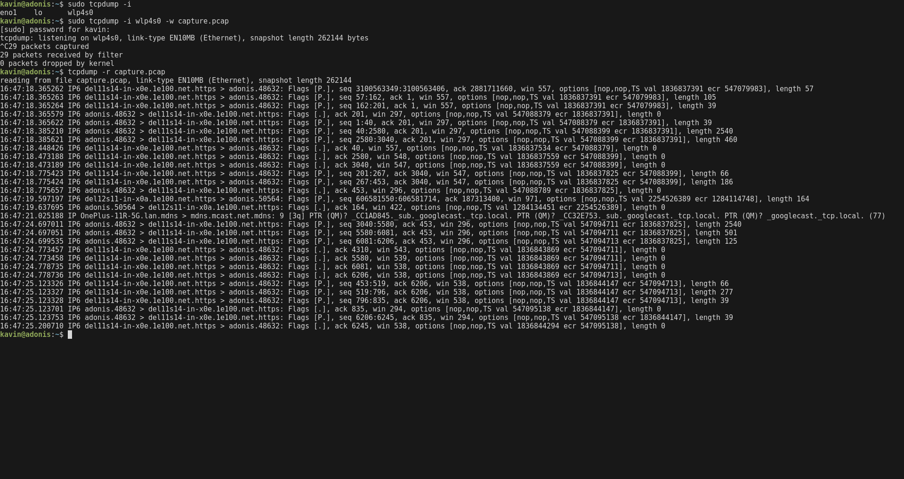
##
### 4. Understand linux utility commands like - ping, arp (Understand each params from ifconfig output)

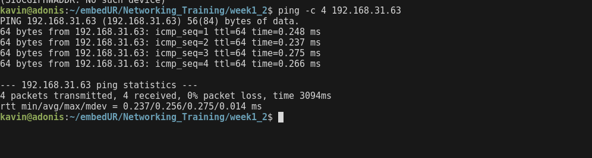
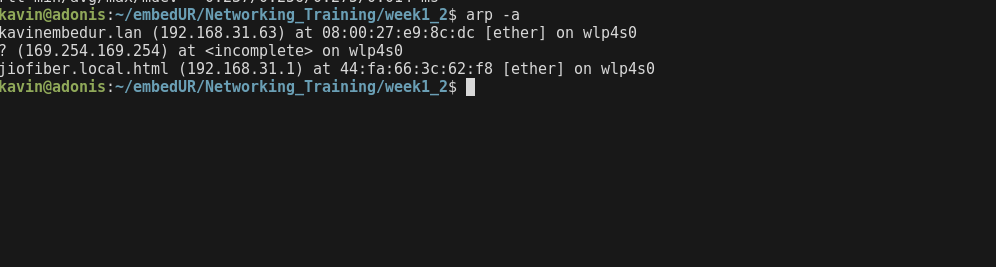
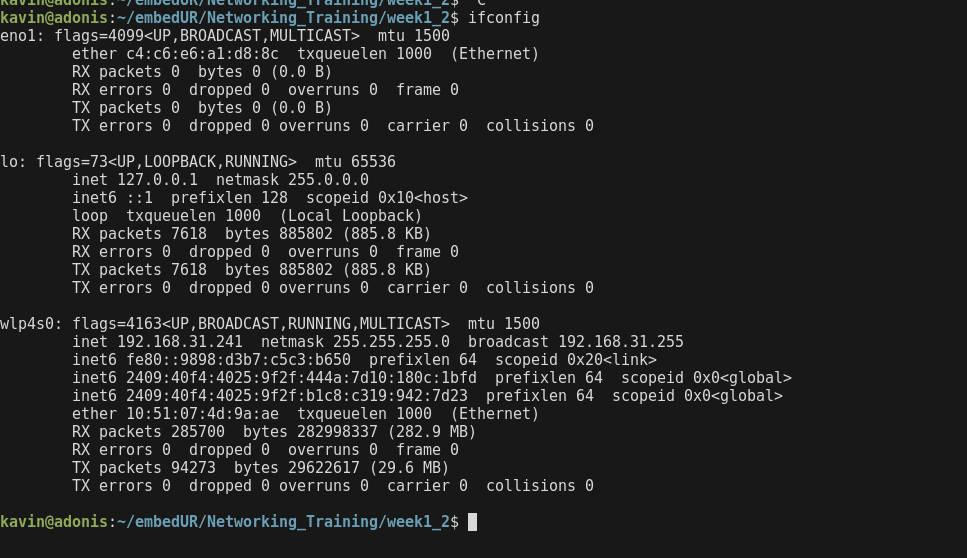

- Here 
    - eno1: Is the wired Ethernet interface 
        - flags=4099<UP,BROADCAST,MULTICAST>:Interface is enabled but an IP address is not assigned , since it is not connected to any network
        - UP: Interface is enabled but not actively connected
        - BROADCAST: Interface supports broadcast packets
        - MULTICAST: Interface supports multicast packets
        - mtu 1500: Maximum Transmission Unit is 1500 bytes (standard for Ethernet) 
        - ether c4:c6:e6:a1:d8:8c: The MAC address of your Ethernet port
        - txqueuelen 1000: Transmission queue length
        - RX/TX packets 0: No data has been received or transmitted (interface is not in use)

    - lo: Loopback interface for internal communication
        - flags=73<UP,LOOPBACK,RUNNING>: Interface is active and functioning
        - mtu 65536: Much larger MTU than standard interfaces (typical for loopback)
        - inet 127.0.0.1: Standard IPv4 loopback address
        - netmask 255.0.0.0: Allows for the entire 127.x.x.x range as loopback
        - inet6 ::1: IPv6 loopback address
        - RX/TX packets matching: In loopback interfaces, received and transmitted packets are always identical

    - wlp4s0: Wireless interface (using predictable naming scheme: w=wireless, p4s0=PCI bus location)
        - flags=4163<UP,BROADCAST,RUNNING,MULTICAST>:

        - UP: Interface is enabled
        - BROADCAST: Supports broadcast packets
        - RUNNING: Interface is connected and active
        - MULTICAST: Supports multicast packets

        - mtu 1500: Standard MTU size
        - inet 192.168.31.241: Your assigned IPv4 address
        - netmask 255.255.255.0: Subnet mask (allows for 254 usable addresses in range 192.168.31.1-254)
        - broadcast 192.168.31.255: Broadcast address for your subnet
        - inet6: Multiple IPv6 addresses:

        - ether 10:51:07:4d:9a:ae: MAC address of wireless interface
        - RX packets 285700 bytes 282998337 (282.9 MB): Received approximately 283 MB of data
        - TX packets 94273 bytes 29622617 (29.6 MB): Transmitted approximately 30 MB of data

##
### 5. Understand what happens when duplicate IPs configured in a network.

- When duplicate IPs are configured in a network, it causes connectivity issues, packet loss, and network instability. Devices may experience intermittent connections as the network gets confused about where to send traffic.

- To fix it:
    - Check IP conflicts using `ip a` and `arp -a`
    - If using DHCP, release & renew IP: `sudo dhclient -r && sudo dhclient`
    - If using static IPs, assign unique addresses in `/etc/netplan/00-installer-config.yaml`
    - Restart networking: `sudo systemctl restart networking`
##

### 6. Understand how to access remote system using (VNC viewer, Anydesk, teamviewer and remote desktop connections)

- VNC Viewe- 
    - Install-  VNC Viewer on your local system.
    - Install-  a VNC Server on the remote system.
    - Enter the remote system's IP address and password to connect.
    - Port: 5900 (Default)

- AnyDesk

    - Install AnyDesk on both local and remote systems.
    - Open AnyDesk and enter the remote system’s AnyDesk ID.
    - The remote user needs to accept the connection request.
    - Port: 7070 (Default, can use dynamic ports)

- TeamViewer

    - Install TeamViewer on both local and remote systems.
    - Open TeamViewer and enter the remote system's TeamViewer ID & password.
    - The remote user may need to accept the connection.
    - Port: 5938 (Primary), also uses 80 & 443 as fallback.

- Remote Desktop Connection (RDP - Windows)

    - Enable Remote Desktop on the remote system (Windows settings).
    - Open mstsc (Remote Desktop Client) on your system.
    - Enter the remote computer's IP address and login credentials.
    - Port: 3389 (Default)

##
### 7. How to check your default gateway is reachable or not and understand about default gateway.

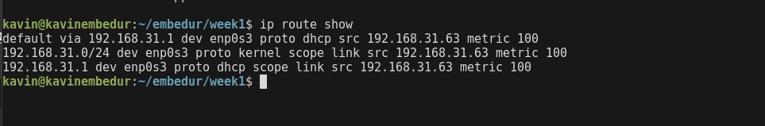

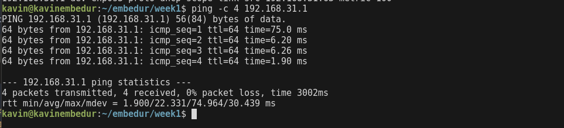

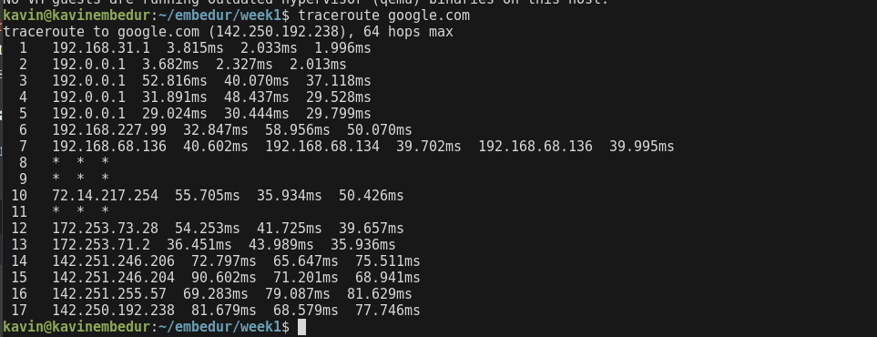

The default gateway (192.168.31.1) serves as the exit point from the local network to external networks. All traffic destined for networks outside the subnet is forwarded to this gateway, which then routes it appropriately.
##

### 8. Check iwconfig/ifconfig to understand in detail about network interfaces (check about interface speed, MTU and other parameters)

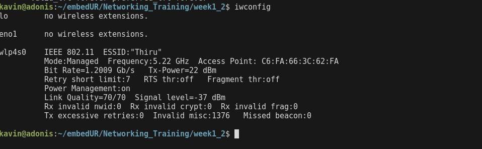

- Interface Name: wlp4s0 -> THe Wi-Fi adapter.
- ESSID: "Thiru" -> The Wi-Fi network SSID or name.
- Mode: Managed -> The device is acting as a client (not an access point).
- Frequency: 5.22 GHz -> The Wi-Fi operates on the 5GHz band.
- Access Point: C6:FA:66:3C:62:FA -> MAC address of the router.
- Bit Rate: 1.0806 Gb/s -> Connection Speed .
- Tx-Power: 22 dBm -> Transmission power of the adapter (higher is stronger).
- Signal Level: -33 dBm -> loser to 0 is better.
- Rx invalid nwid: 0 -> No network ID mismatches.
- Tx excessive retries: 0 -> No excessive retries while sending data.

- Ethernet Interface (eno1)
    - Status: UP, BROADCAST, MULTICAST (enabled but not receiving data)
    - MTU: 1500 (default for Ethernet)
    - MAC Address: c4:c6:e6:a1:d8:8c
    - RX/TX Packets: 0 (not in use)

` wired connection is not  plugged in`

- Loopback Interface (lo)
    - IP Address: 127.0.0.1 (used for local communication).
    - MTU: 65536 (high because it's software-based).
    - RX/TX Packets: 12731 (normal).

- Wireless Interface (wlp4s0)

    - Status: UP, BROADCAST, RUNNING, MULTICAST (active and working).
    - IP Address: 192.168.31.241 (assigned by the router).
    - Subnet Mask: 255.255.255.0.
    - Broadcast Address: 192.168.31.255.
    - IPv6 Addresses:
        - fe80::9898:d3b7:c5c3:b650 (Link-local).
        - 2409:40f4:4025:9f2f:... (Global).
    - MAC Address: 10:51:07:4d:9a:ae.
    - Data Transferred:
        - Received: 3.4 GB.
        - Sent: 104.9 MB.

` Wi-Fi is working properly with active data transmission.`
##

### 9. Log in to your home router's web interface (usually at 192.168.1.1 or 192.168.0.1) and check the connected devices list.

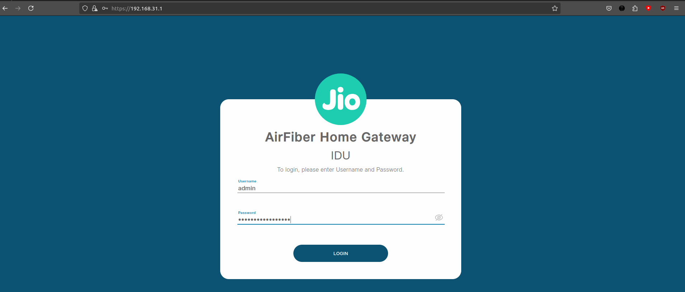
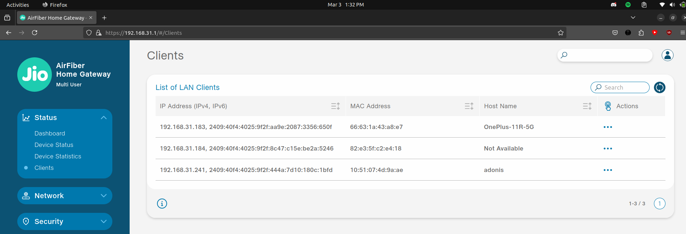

##

### 10. Explain how a DHCP server assigns IP addresses to devices in your network. 

- A DHCP server assigns IP addresses dynamically to devices in a network.
    - Device requests an IP (DHCPDISCOVER).
    - Server offers an IP (DHCPOFFER).
    - Device accepts the offer (DHCPREQUEST).
    - Server confirms the IP assignment (DHCPACK).
    - Device uses the IP for a lease period and renews when needed.

##

### 11. Using a terminal, connect to a remote machine via SSH and telnet.

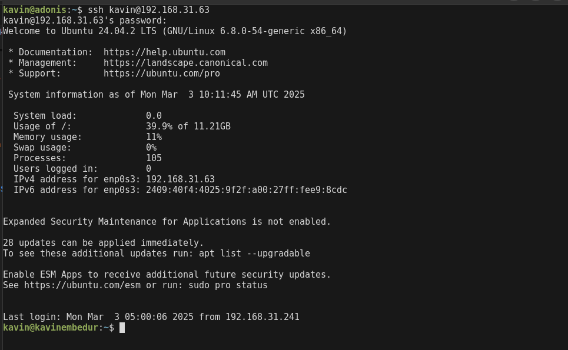