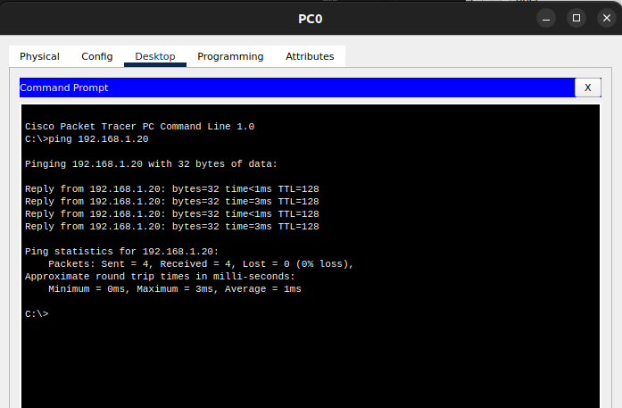

# Networking Module Week 3 & 4 Assignment Solutions

## Tools Used
- Cisco Packet Tracer (primary tool)
- Wireshark (for detailed packet analysis)

## Task 1: Small Network with MAC Table Observation and Frame Analysis


- 1 Cisco 2960 Switch
- 3-4 PCs
- Ethernet cables (straight-through)

### Step-by-Step Instructions

#### 1. Create the network topology


 

#### 2. Configure IP addresses on all devices
1. Click on PC1
2. Go to Desktop tab → IP Configuration
3. Configure with:
   - IP Address: 192.168.1.2
   - Subnet Mask: 255.255.255.0
4. Repeat for all PCs using sequential addresses:
   - PC2: 192.168.1.3
   - PC3: 192.168.1.4


#### 3. Generate traffic and observe MAC table
1. Click on PC1
2. Go to Desktop tab → Command Prompt
3. Ping the other PCs:
   
   ```
   ping 192.168.1.3
   ping 192.168.1.4
   ```


4. Access the switch's CLI:
   - Click on the switch
   - Go to CLI tab
   - Type: `enable`
   - Type: `show mac address-table`


#### 4. Capture and analyze frames
1. Switch to Simulation mode:
   - Click the "Simulation" button in the bottom right corner
2. Set up packet filters:
   - In the simulation panel, click "Edit Filters"
   - Uncheck "Show All/None"
   - Check only "ICMP" and "ARP"
   - Click OK


3. Generate traffic in simulation mode:
   - Click on PC1
   - Go to Desktop tab → Command Prompt
   - Type: `ping 192.168.1.3`
   - In the simulation panel, click "Capture/Forward" to step through the packets
   - Click on any packet (envelope icon) to view its details


## Task 2: Detailed Ethernet Frame Analysis


#### Network
 

#### 1. Using Packet Tracer's simulation mode for frame analysis
1. Ensure you're in Simulation mode
2. Configure more detailed filters:
   - Click "Edit Filters"
   - Select protocols you want to analyze (ARP, ICMP, TCP, UDP, etc.)
   - Click OK


3. Generate various types of traffic:
   - Ping between devices
   - If possible, generate other traffic types (HTTP, FTP, etc.)


4. Capture and inspect different frame types:
   - Click on different packets in the simulation panel
   - For each, analyze the Ethernet frame structure
   


## Task 3: Configure Static IP and MAC Addresses

#### 1. Configure static IP addresses
1. Click on PC1
2. Go to Desktop tab → IP Configuration
3. Configure a new static IP:
   - IP Address: 192.168.1.10
   - Subnet Mask: 255.255.255.0

4. Repeat for other PCs with different IPs:
   - PC2: 192.168.1.10
   - PC3: 192.168.1.20
   - Server 192.168.1.30


#### 2. Modify MAC addresses
1. Click on PC1
2. Go to Config tab
3. Select "FastEthernet0" in the left panel
4. In the right panel, find "MAC Address" field
5. Change it to a custom address, e.g., 00-11-22-33-44-55
6. Click Save


7. Repeat for other PCs using different MAC addresses:
   - PC2: 00-22-33-44-55-66
   - PC3: 00-33-44-55-66-77


#### 3. Verify connectivity
1. Click on PC1
2. Go to Desktop tab → Command Prompt
3. Check configuration with:
   ```
   ipconfig /all
   ```
4. Test connectivity to other PCs:
   ```
   ping 192.168.1.101
   ping 192.168.1.102

   ```


5. Check the switch's MAC table:
   - Click on the switch
   - Go to CLI tab
   - Type: `enable`
   - Type: `show mac address-table`


## Tasks 4-7: Troubleshoot Ethernet Communication

### Equipment Required
- 1 Cisco 2960 Switch
- 2 PCs (to represent Linux machines)
- Ethernet cablesk

### Step-by-Step Instructions

#### 1. Create a simple LAN setup
1. Create a new network or modify the existing one:
   - Keep one switch
   - Keep or add two PCs (Linux1 and Linux2)
   - Connect both PCs to the switch


#### 2. Configure network settings
1. Configure Linux1:
   - IP Address: 192.168.1.10
   - Subnet Mask: 255.255.255.0
2. Configure Linux2:
   - IP Address: 192.168.1.20
   - Subnet Mask: 255.255.255.0


#### 3. Verify basic connectivity
1. From Linux1, ping Linux2:
   - Click Linux1 → Desktop → Command Prompt
   - Type: `ping 192.168.1.20`
   - Verify successful communication




#### 4. Create and troubleshoot network issues

##### Scenario 1: IP Addressing Issue
1. Create addressing problem:
   - Change Linux2's IP to a different subnet (e.g., 192.168.2.20)
   - Keep subnet mask as 255.255.255.0


2. Test connectivity:
   - From Linux1, ping Linux2: `ping 192.168.2.20`
   - Observe the failure


3. Troubleshoot with ifconfig:
   - On Linux1, type: `ipconfig` (Packet Tracer's equivalent to ifconfig)
   - On Linux2, type: `ipconfig`
   - Identify the subnet mismatch


4. Use traceroute:
   - On Linux1, type: `tracert 192.168.2.20`
   - Observe that packets aren't reaching destination


5. Fix the issue:
   - Change Linux2's IP back to 192.168.1.20


## Task 8: Linux Kernel's Handling of Ethernet Devices

1. **Kernel Components for Ethernet Support**
   - Device drivers (`drivers/net/ethernet/`)
   - Network device subsystem (`net/core/`)
   - Protocol handlers (`net/ethernet/`)
   - Socket buffers (`include/linux/skbuff.h`)

2. **Ethernet Device Registration and Operation**
   - How drivers register with the kernel
   - Network device lifecycle (initialization, operation, shutdown)
   - Implementation of the `struct net_device` structure

3. **Packet Transmission and Reception Process**
   - Transmit path through the kernel stack
   - Receive path and interrupt handling
   - Relationship with upper protocol layers (IP, TCP, etc.)

4. **Configuration and Management Interfaces**
   - sysfs interfaces (`/sys/class/net/`)
   - procfs interfaces (`/proc/net/`)
   - netlink sockets
   - ethtool functionality


## Task 9: Configuring LAN Interface with ip Command

#### Basic Interface Configuration

1. **Viewing Network Interfaces**
   ```bash
   ip link show
   ```

2. **Enabling/Disabling Interfaces**
   ```bash
   # Bring up an interface
   ip link set dev eth0 up
   
   # Bring down an interface
   ip link set dev eth0 down
   ```

3. **Configuring IP Addresses**
   ```bash
   # Add an IP address
   ip addr add 192.168.1.10/24 dev eth0
   
   # Remove an IP address
   ip addr del 192.168.1.10/24 dev eth0
   
   # Show IP address configuration
   ip addr show dev eth0
   ```

4. **Configuring Routes**
   ```bash
   # Add default gateway
   ip route add default via 192.168.1.1
   
   # Add specific route
   ip route add 10.0.0.0/24 via 192.168.1.254
   
   # Show routing table
   ip route show
   ```

#### Advanced Configuration

1. **Changing MAC Address**
   ```bash
   ip link set dev eth0 address 00:11:22:33:44:55
   ```

2. **Setting MTU**
   ```bash
   ip link set dev eth0 mtu 9000
   ```

3. **Managing ARP Table**
   ```bash
   # Show ARP entries
   ip neigh show
   
   # Add static ARP entry
   ip neigh add 192.168.1.5 lladdr 00:11:22:33:44:55 dev eth0
   ```

## Task 10: View MAC Address Table in Linux

### Linux Bridge MAC Table Commands

#### Linux Bridge Commands
1. **View MAC Address Table**
   ```bash
   # View entire forwarding database
   bridge fdb show
   
   # View entries for specific interface
   bridge fdb show dev eth0
   
   # Filter by MAC address
   bridge fdb show mac 00:11:22:33:44:55
   ```

2. **Using ip Command for Neighbor Information**
   ```bash
   # View ARP/neighbor cache
   ip neigh show
   ```

#### Simulating in Packet Tracer
Since Packet Tracer doesn't fully support Linux bridge commands, you can:

1. Show the equivalent in Cisco's CLI:
   - Click on switch
   - Go to CLI tab
   - Type: `enable`
   - Type: `show mac address-table`


2. Explain how this relates to Linux bridge functionality:
   - The bridge module in Linux performs similar MAC learning
   - Linux bridges forward frames based on MAC address tables
   - Both hardware switches and Linux bridges follow the same principles
