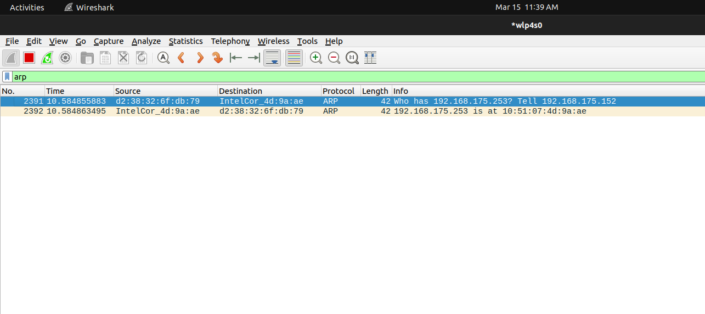
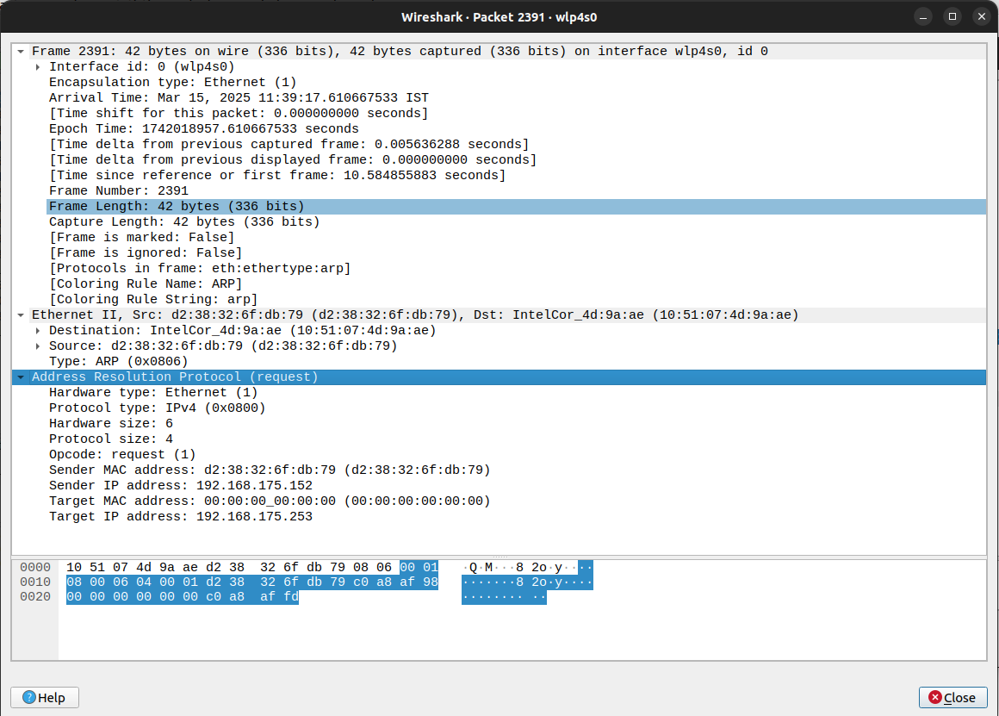
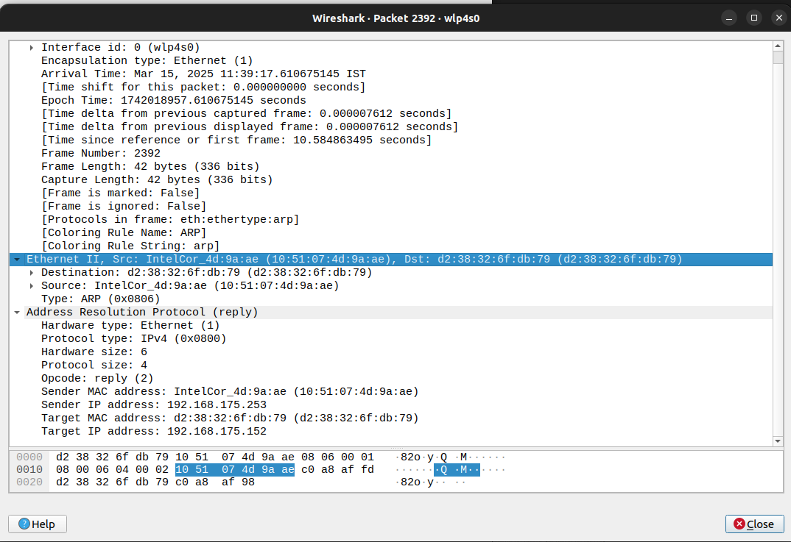

### Capture and analyze ARP packets using Wireshark. Inspect the ARP request and reply frames, and discuss the role of the sender's IP and MAC address in these packets.

- Firstly I tried to analyse the traffic of my university network but finding the request and reply pair 

- Instead i used my personal hotstop and used the `arp` command to generate a single request and response pair.

- The request packet

- The response packet

- Role of IP and MAC in ARP Packets:
    - The sender's IP in the ARP request is the one seeking the MAC address.
    - The sender's MAC helps the receiver know where to send the reply.
    - The reply packet ensures that devices can communicate using MAC addresses at the data link layer while using IP at the network layer.