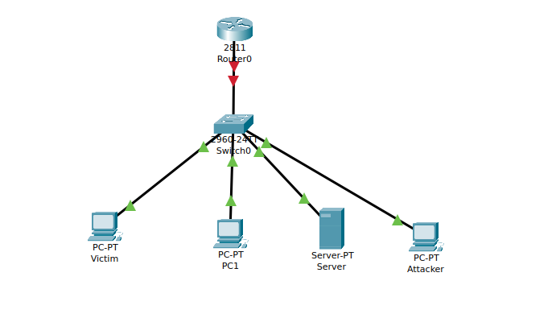
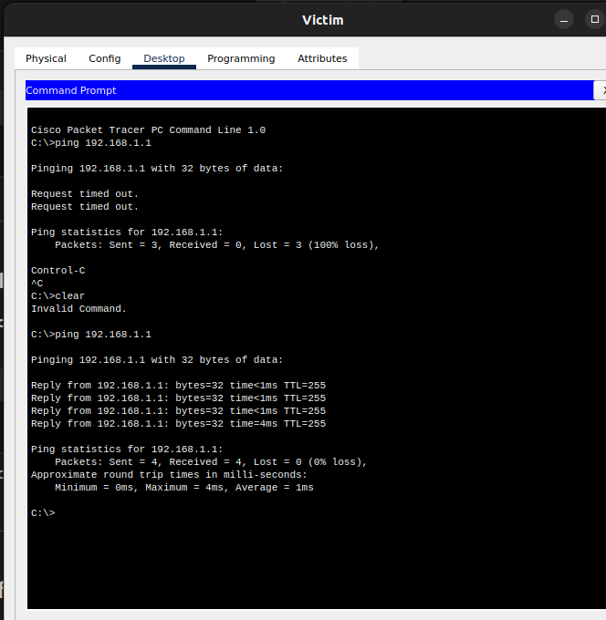
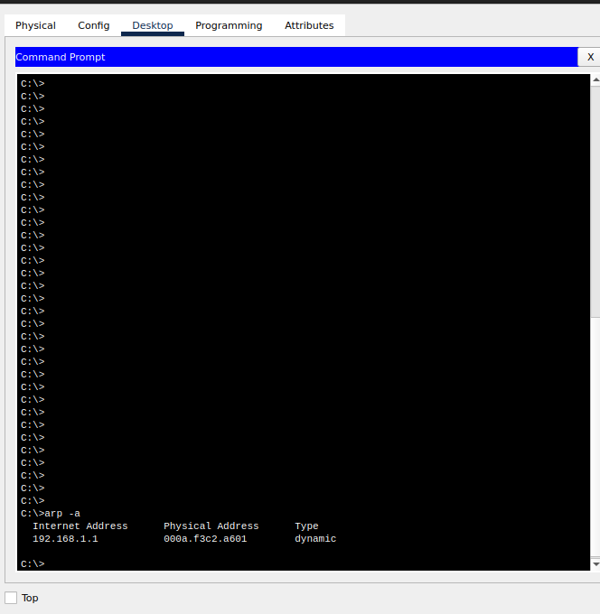
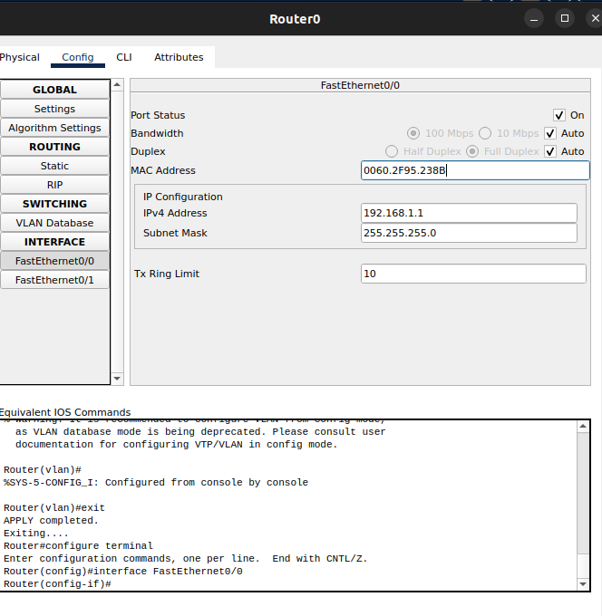
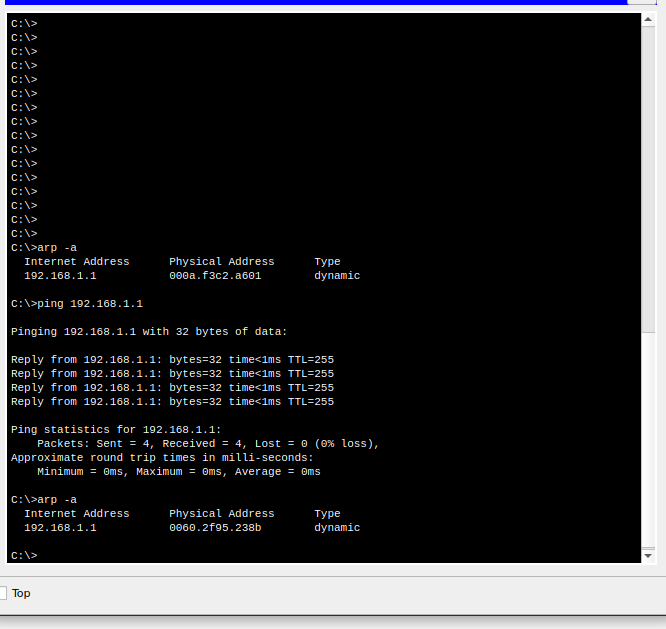

###  Using Packet Tracer, simulate an ARP spoofing attack. Analyze the behavior of devices on the network when they receive a malicious ARP response.


- The topology used here




- The IP address are as follows

| Device |IP Address      | Subnet Mask   |
|--------|----------------|---------------|
| Router |  192.168.1.1     | 255.255.255.0 |
| Victim PC |  192.168.1.2 | 255.255.255.0 |
| PC1 (Normal)| 192.168.1.3 | 255.255.255.0 |
| Server | 2.168.1.4 | 255.255.255.0 |
| Attacker PC  | 192.168.1.100 | 255.255.255.0 |

- We assign IP to the router using the following commands

```
enable
configure terminal
interface FastEthernet0/0
ip address 192.168.1.1 255.255.255.0
no shutdown
exit
```

- Connection is established between router and the PCs




- ARP table of the victim 



- Changing the MAC address of the router to the MAC of the attacker



- After that if you ping `192.168.1.1` again and check thr ARP table we can see the MAC address of the attacker not router




