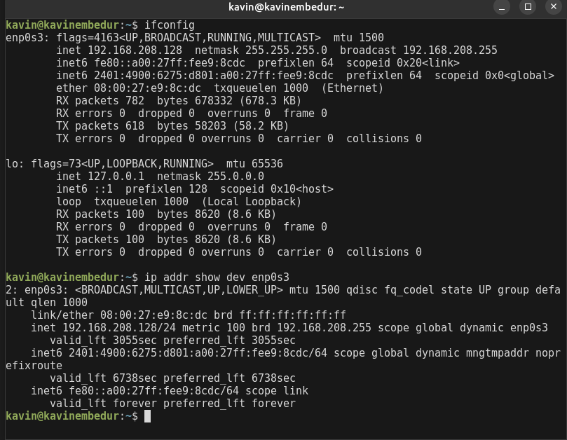
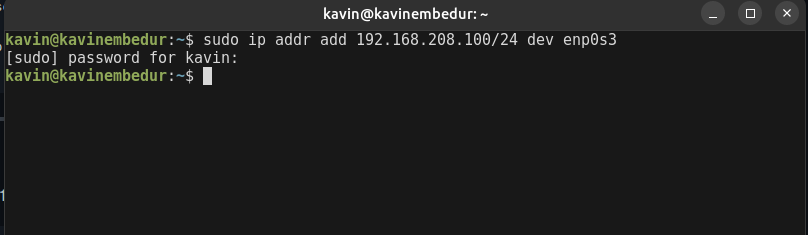
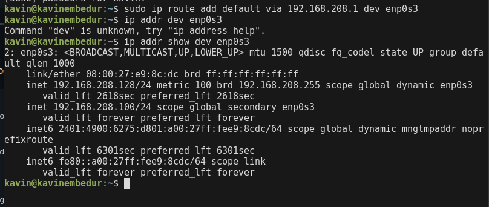

### Manually configure static IPs on the client devices (like Pc or your mobile phone) and verify connectivity using ping.

- Here I have used a Ubuntu Server VM 

- First we choose the active network interface of the PC

- Then we assign a static IP address 

- We configure the default gateway and check if the changes have been reflected 

- Verifying the connectivity 
