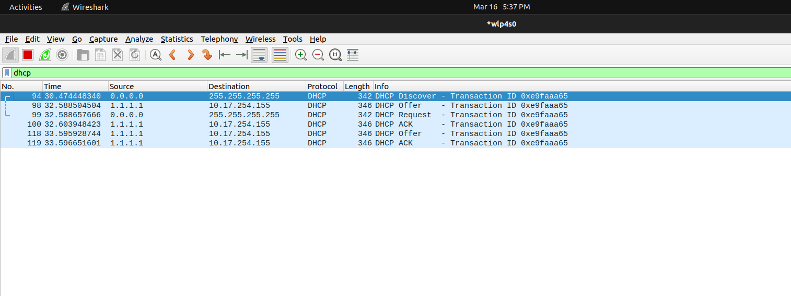
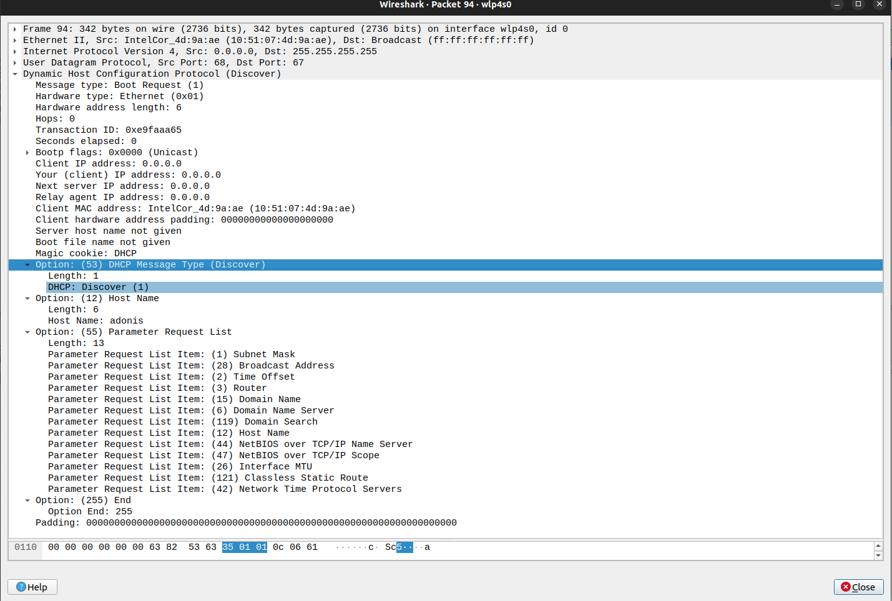
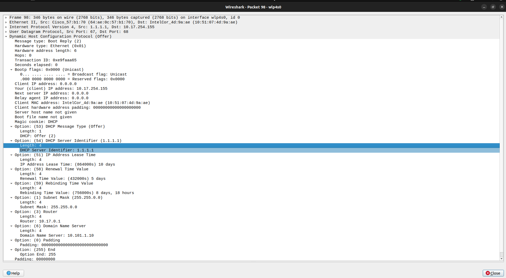
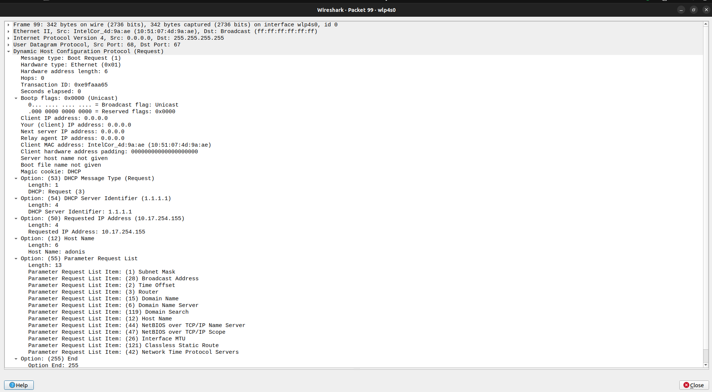
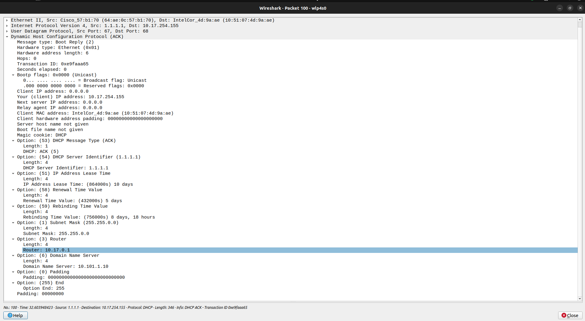

### Use Wireshark to capture DHCP Discover, Offer, Request, and Acknowledge messages and explain the process.

- So firstly here we open wireshark and apply the dhcp capture filter.

- Then we use the `dhclient -r` command to release the current IP address of the machiene 

- Then again use the dhclinet command to assign a new IP address to the machiene.

- The below are the packets DHCP packets captured when using the `dhclient`command

- The Discover Packet

- The offer packet

- The Request Packet

- The Acknoledgement Packet (ACK)

### Understanding the DHCP process (DORA)

- It mainly has 4 steps 
    - Discover 
    - Offer 
    - Request
    - Acknowledge

- Discover
    - Source `client`
    - The client requests an IP address.

- Offer
    - Source `DHCP Server`
    - The server offers an IP address to the client.

- Request
    - Source `Client`
    - The client requests the offered IP.

- ACK
    - Source `DHCP Server`
    - The server confirms that the IP has been assigned.