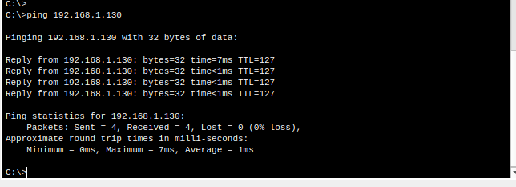

###  Given an IP address range of 192.168.1.0/24, divide the network into 4 subnets.
#### Task: Manually calculate the new subnet mask and the range of valid IP addresses for each subnet. 
#### Assign IP addresses from these subnets to devices in Cisco Packet Tracer and verify connectivity using ping between them.


- Before We make the topology in packettracer here are few things to clarify


- Im using the Cisco 2811 router it has only 2 interfaces thus im adding an additional network module which is the NM-2FE2W to get additional FastEthernet ports


- The topology


- Now we must assign IP addresses to the PC's and configure the router 


| **PC**  | **Connected to Switch** | **Subnet**           | **IP Address**    | **Subnet Mask**     | **Default Gateway**  |
|---------|--------------------|-------------------|----------------|------------------|------------------|
| **PC0** | Switch 0          | 192.168.1.0   | 192.168.1.10   | 255.255.255.192  | 192.168.1.1      |
| **PC1** | Switch 1          | 192.168.1.64  | 192.168.1.70   | 255.255.255.192  | 192.168.1.65     |
| **PC2** | Switch 2          | 192.168.1.128 | 192.168.1.130  | 255.255.255.192  | 192.168.1.129    |
| **PC3** | Switch 3          | 192.168.1.192 | 192.168.1.200  | 255.255.255.192  | 192.168.1.193    |


- After assigning the IP address we enter the configuration mode in the router 


- The we will configure each router interdfaces using the following command

```
interface FastEthernet0/0
ip address 192.168.1.1 255.255.255.192
no shutdown
exit

interface FastEthernet0/1
ip address 192.168.1.65 255.255.255.192
no shutdown
exit

interface FastEthernet1/0
ip address 192.168.1.129 255.255.255.192
no shutdown
exit

interface FastEthernet1/1
ip address 192.168.1.193 255.255.255.192
no shutdown
exit


```
- After that the topology will be all enables and connected


- We are able to ping from one subnet to another



