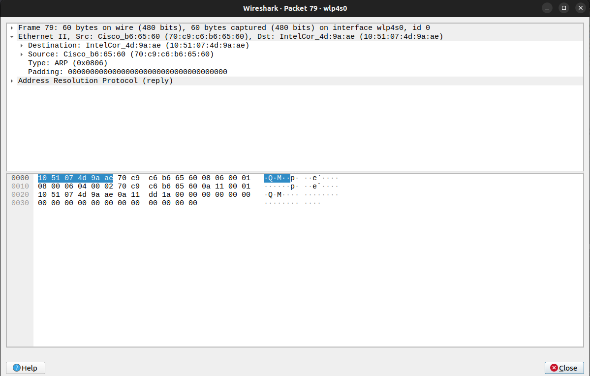

### Capture and analyze ARP packets using Wireshark. Inspect the ARP request and reply frames when your device attempts to find the router's MAC address. Discuss the importance of ARP in packet forwarding.

ARP Request Packet

-  Source MAC Address: device’s MAC.
-  Destination MAC Address: FF:FF:FF:FF:FF:FF (Broadcast).
-  Source IP Address: device’s IP.
-  Target IP Address: The router’s IP.

ARP Reply Packet:

-  Source MAC Address: Router’s MAC.
-  Destination MAC Address: device’s MAC.
-  Source IP Address: Router’s IP.
-  Target IP Address: device’s IP

