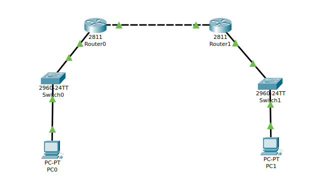
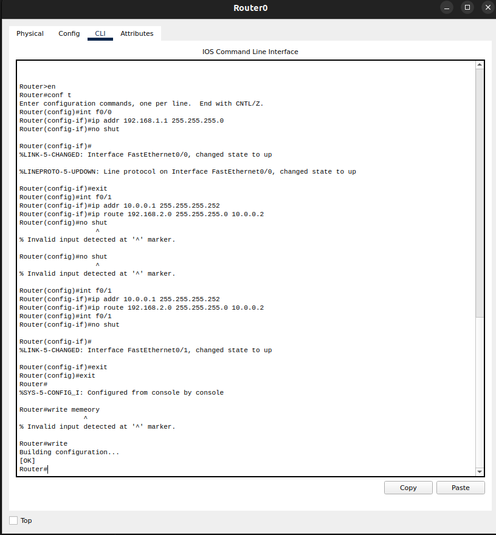
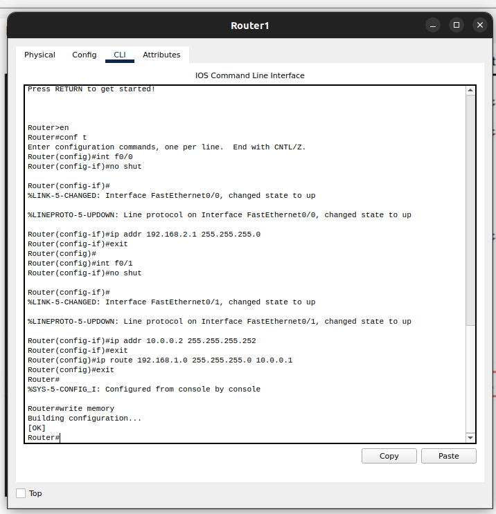
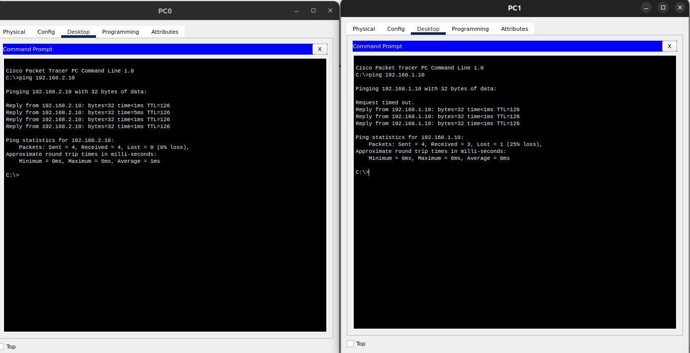

### Manually configure static routes on a router to direct packets to different subnets. Use the ip route command and verify connectivity using ping and traceroute.

- The topology of the network

- The Router configuration

- Ping from the PCs
