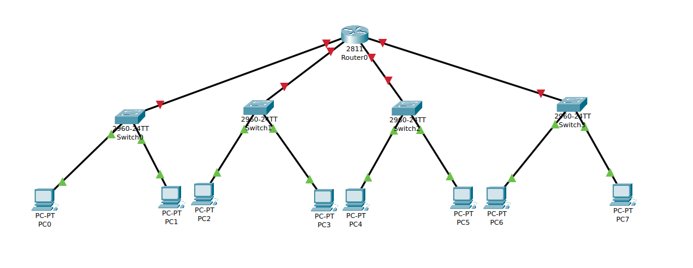
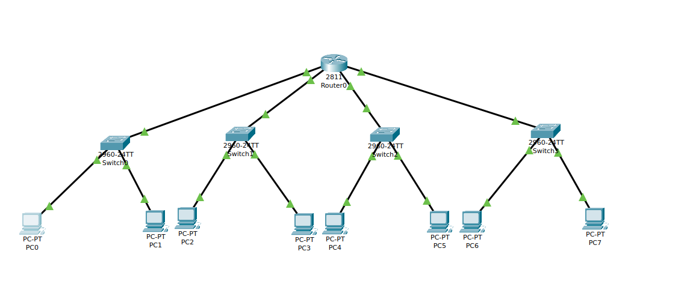
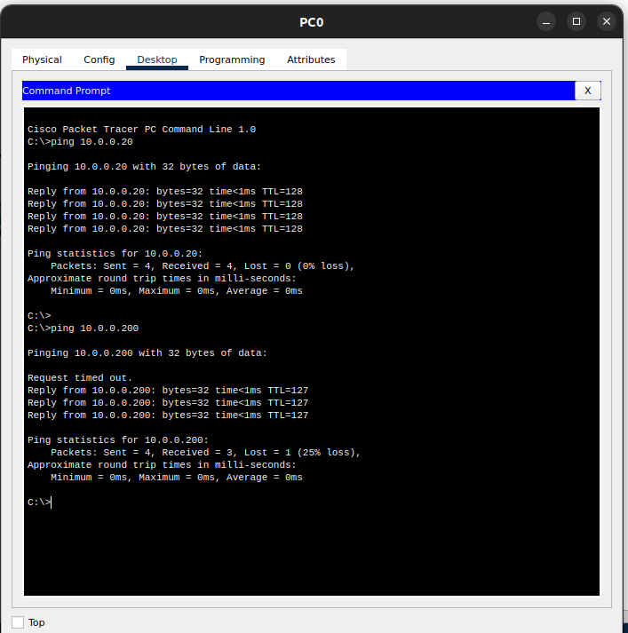
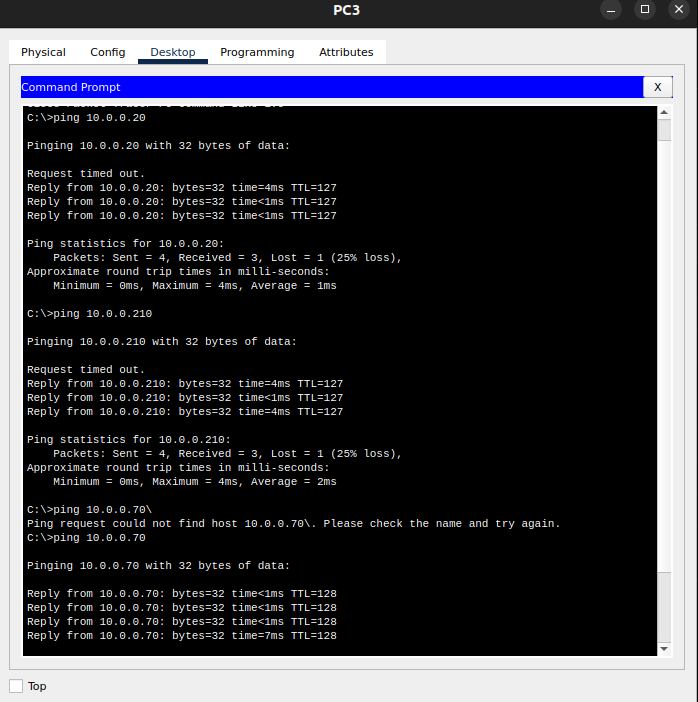

### Given a network address of 10.0.0.0/24, divide it into 4 equal subnets.Calculate the new subnet mask.Determine the valid host range for each subnet.Assign IP addresses to devices in Packet Tracer and verify connectivity.


- Original network: **10.0.0.0/24** (**255.255.255.0**)  
- **4 subnets needed** → Borrow **2 bits** → New subnet mask = **/26 (255.255.255.192)**  
- Each subnet has **64 IPs** (62 usable).

### Divide into Subnets
| Subnet | Network Address | First Host | Last Host | Broadcast Address |
|--------|----------------|------------|-----------|-------------------|
| **Subnet 1** | 10.0.0.0/26 | 10.0.0.1 | 10.0.0.62 | 10.0.0.63 |
| **Subnet 2** | 10.0.0.64/26 | 10.0.0.65 | 10.0.0.126 | 10.0.0.127 |
| **Subnet 3** | 10.0.0.128/26 | 10.0.0.129 | 10.0.0.190 | 10.0.0.191 |
| **Subnet 4** | 10.0.0.192/26 | 10.0.0.193 | 10.0.0.254 | 10.0.0.255 |

---

#### Configure Router and PCs

   ```bash
   enable
   configure terminal

   interface FastEthernet0/0
     ip address 10.0.0.1 255.255.255.192
     no shutdown
   exit

   interface FastEthernet0/1
     ip address 10.0.0.65 255.255.255.192
     no shutdown
   exit

   interface FastEthernet1/0
     ip address 10.0.0.129 255.255.255.192
     no shutdown
   exit

   interface FastEthernet1/1
     ip address 10.0.0.193 255.255.255.192
     no shutdown
   exit

   end
   write memory
   ```

---



#### Assign IPs to PCs


| PC  | IP Address        | Subnet Mask       | Default Gateway |
|-----|------------------|------------------|----------------|
| PC0 | 10.0.0.10       | 255.255.255.192  | 10.0.0.1       |
| PC1 | 10.0.0.20       | 255.255.255.192  | 10.0.0.1       |
| PC2 | 10.0.0.70       | 255.255.255.192  | 10.0.0.65      |
| PC3 | 10.0.0.80       | 255.255.255.192  | 10.0.0.65      |
| PC4 | 10.0.0.130      | 255.255.255.192  | 10.0.0.129     |
| PC5 | 10.0.0.140      | 255.255.255.192  | 10.0.0.129     |
| PC6 | 10.0.0.200      | 255.255.255.192  | 10.0.0.193     |
| PC7 | 10.0.0.210      | 255.255.255.192  | 10.0.0.193     |

---



