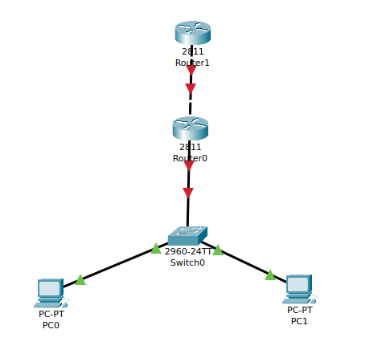
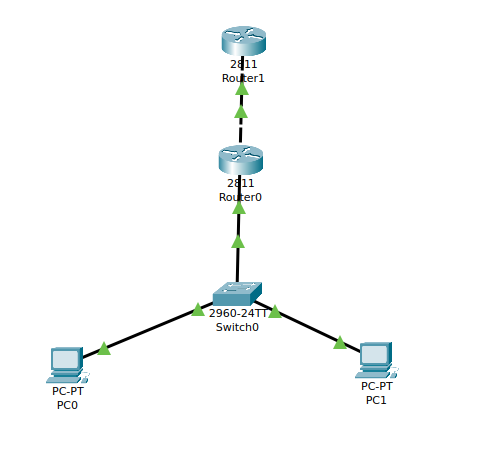
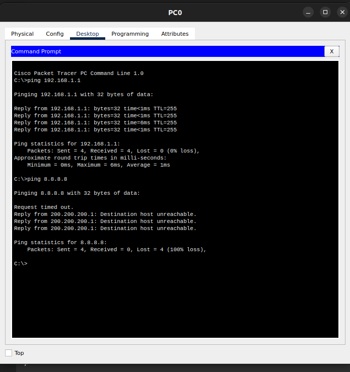
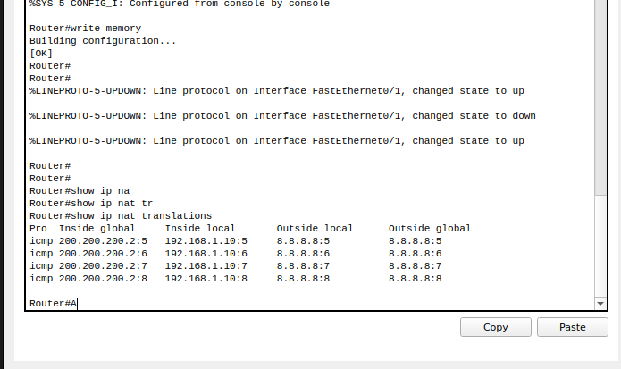

### In Cisco Packet Tracer, configure NAT on a router to allow internal devices (192.168.1.x) to access the internet.Test connectivity by pinging an external public IP.Capture the traffic in Wireshark and analyze the source IP before and after NAT translation.


- The topology used.




- Configure the NAT router with the following commands

```bash

enable
configure terminal
interface FastEthernet0/0
ip address 192.168.1.1 255.255.255.0
no shutdown

interface FastEthernet0/1
ip address 200.200.200.2 255.255.255.0
no shutdown
exit


#now we write configure NAT
#create a ACL to identify internal network
access-list 1 permit 192.168.1.0 0.0.0.255

#configure nat overhead (PAT)
ip nat inside source list 1 interface FastEthernet0/1 overload

# assign NAT roles to the interfaces
interface FastEthernet0/0
ip nat inside
exit

interface FastEthernet0/1
ip nat outside
exit


#Default route to ISP
ip route 0.0.0.0 0.0.0.0 200.200.200.1

```

- Configure the ISP router

```bash
enable
configure terminal

interface FastEthernet0/0  # Connected to NAT Router
ip address 200.200.200.1 255.255.255.0
no shutdown
exit


ip route 0.0.0.0 0.0.0.0 203.0.113.1

```




- Ping test



- NAT translation that is happening on the router

