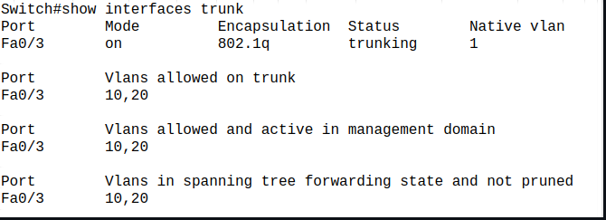
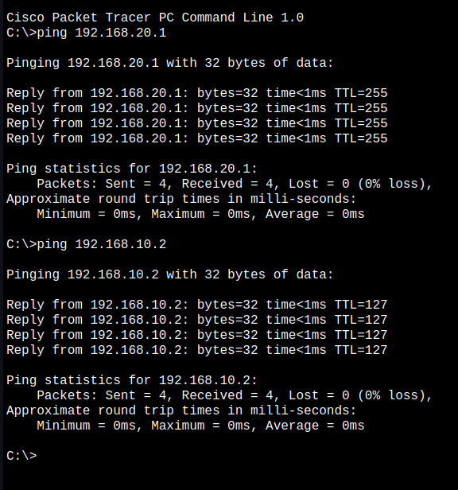

### Try Inter VLAN routing with Router


- Network topology

Configuring Switch

    Create VLANs on the Switch

```
Switch(config)# vlan 10
Switch(config-vlan)# name DATA_VLAN
Switch(config-vlan)# exit

Switch(config)# vlan 20
Switch(config-vlan)# name VOICE_VLAN
Switch(config-vlan)# exit

```
- Assigning ports to VLANs

```
Switch(config)# interface Fa0/1
Switch(config-if)# switchport mode access
Switch(config-if)# switchport access vlan 10
Switch(config-if)# no shutdown
Switch(config-if)# exit
```
```
Switch(config)# interface Fa0/2
Switch(config-if)# switchport mode access
Switch(config-if)# switchport access vlan 20
Switch(config-if)# no shutdown
Switch(config-if)# exit
```
- Configuring trunk port to the router
```
Switch(config)# interface Fa0/3
Switch(config-if)# switchport mode trunk
Switch(config-if)# switchport trunk encapsulation dot1q
Switch(config-if)# switchport trunk allowed vlan 10,20
Switch(config-if)# no shutdown
Switch(config-if)# exit
```



- Configuring Router


```
Router(config)# interface GigabitEthernet0/0
Router(config-if)# no shutdown
Router(config-if)# exit

Router(config)# interface GigabitEthernet0/0.10
Router(config-subif)# encapsulation dot1Q 10
Router(config-subif)# ip address 192.168.10.1 255.255.255.0
Router(config-subif)# exit

Router(config)# interface GigabitEthernet0/0.20
Router(config-subif)# encapsulation dot1Q 20
Router(config-subif)# ip address 192.168.20.1 255.255.255.0
Router(config-subif)# exit

Router# show ip interface brief # To verify the interfaces
```


- Ping Test between 2 different VLANs
