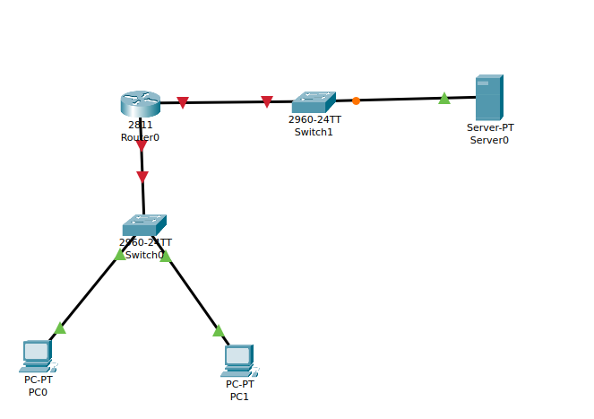
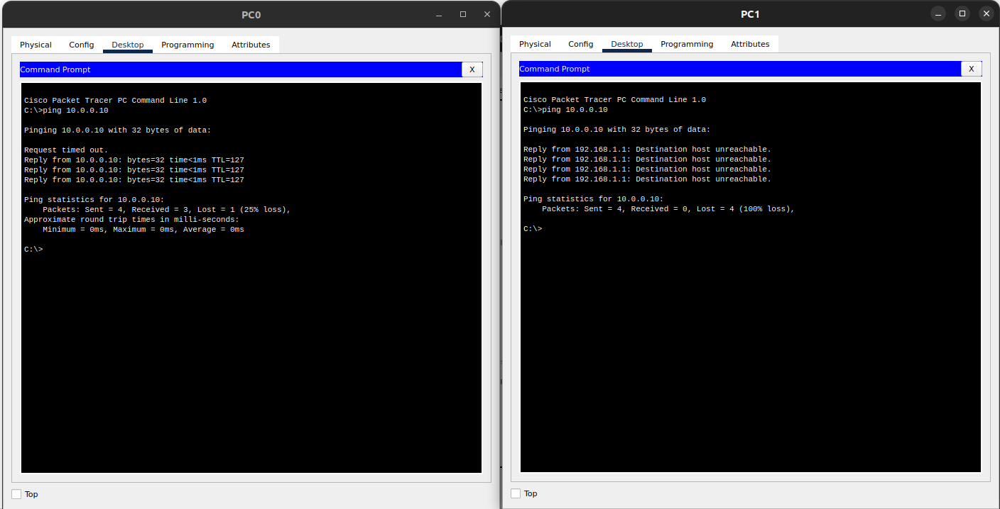

### Configure a standard Access Control List (ACL) on a router to permit traffic from a specific IP range. Test connectivity to verify the ACL is working as intended. 


- The topology used




- IPs
    - PC0: 192.168.1.10
    - PC1: 192.168.1.20
    - Server: 10.0.0.10


- Router Configuration.

```bash
Router>en
Router#conf t
Enter configuration commands, one per line.  End with CNTL/Z.
Router(config)#ini
Router(config)#
Router(config)#interface FastEthernet0/0
Router(config-if)#
Router(config-if)#ip ad
Router(config-if)#ip address 192.168.1.1 255.255.255.0
Router(config-if)#no shut

Router(config-if)#
%LINK-5-CHANGED: Interface FastEthernet0/0, changed state to up

%LINEPROTO-5-UPDOWN: Line protocol on Interface FastEthernet0/0, changed state to up

Router(config-if)#exit
Router(config)# acc
Router(config)# access-list 10 per
Router(config)# access-list 10 permit host 192.168.1.10
Router(config)#acc
Router(config)#access-list 10 deny any
Router(config)#int f0/0
Router(config-if)#ip acc
Router(config-if)#ip access-group 10 in
Router(config-if)#exit
Router(config)#do write
Building configuration...
[OK]
Router(config)#^Z
Router#
%SYS-5-CONFIG_I: Configured from console by console

Router#sh ac
Router#sh access-lists 
Standard IP access list 10
    10 permit host 192.168.1.10
    20 deny any

Router#
Router#
Router#
```


- ping test

