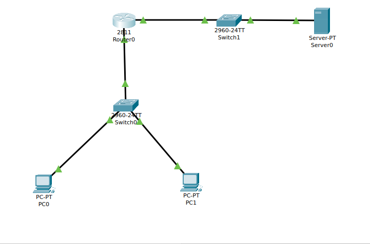
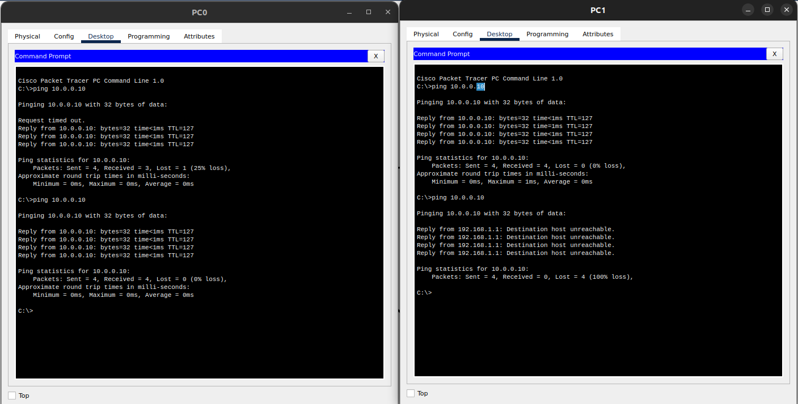

### Create an extended ACL to block specific applications, such as HTTP or FTP traffic. Test the ACL rules by attempting to access blocked services.

- The topology




- IPs
    - PC0: 192.168.1.10
    - PC1: 192.168.1.20
    - Server: 10.0.0.10


- Router Configuration

```bash

Router>
Router>
Router>en
Router#conf t
Enter configuration commands, one per line.  End with CNTL/Z.
Router(config)#int f 0/0 
Router(config-if)#ip add
Router(config-if)#ip address 192.168.1.1 255.255.255.0
Router(config-if)#no shut

Router(config-if)#
%LINK-5-CHANGED: Interface FastEthernet0/0, changed state to up

%LINEPROTO-5-UPDOWN: Line protocol on Interface FastEthernet0/0, changed state to up

Router(config-if)#
Router(config-if)#exit 
Router(config)#int f 0/1
Router(config-if)#ip addr 10.0.0.1 255.255.255.0
Router(config-if)#no shut

Router(config-if)#
%LINK-5-CHANGED: Interface FastEthernet0/1, changed state to up

%LINEPROTO-5-UPDOWN: Line protocol on Interface FastEthernet0/1, changed state to up

Router(config-if)#exit
Router(config)#
Router(config)#acc
Router(config)#access-list 120 per
Router(config)#access-list 120 permit ip
Router(config)#access-list 120 permit ip 192.168.1.10 255.255.255.0 10.0.0.10 255.255.255.0
Router(config)#accl
Router(config)#acc
Router(config)#access-list 120 den
Router(config)#access-list 120 deny ip 192.168.1.20 255.255.255.0 10.0.0.10 255.255.255.0
Router(config)#acc
Router(config)#access-list 120 deny tcp any any e
Router(config)#access-list 120 deny tcp any any eq 80
Router(config)#access-list 120 deny tcp any any eq 21
Router(config)#sh
Router(config)#^Z
Router#
%SYS-5-CONFIG_I: Configured from console by console

Router#sh
Router#show ac
Router#show access-lists 
Extended IP access list 120
    10 permit ip 0.0.0.10 255.255.255.0 0.0.0.10 255.255.255.0
    20 deny ip 0.0.0.20 255.255.255.0 0.0.0.10 255.255.255.0
    30 deny tcp any any eq www
    40 deny tcp any any eq ftp

Router#
```

- ping 

- Can see that http traffic not sending 
