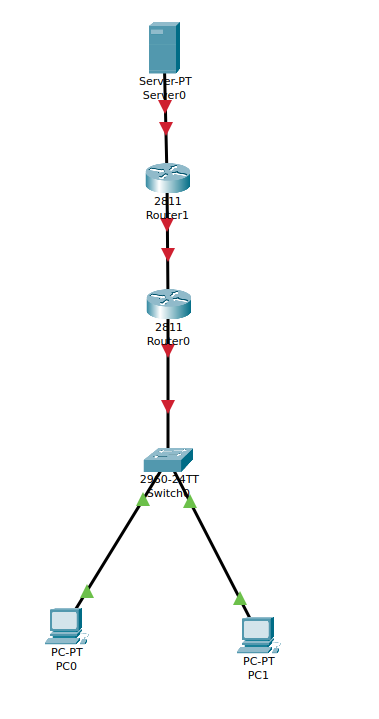
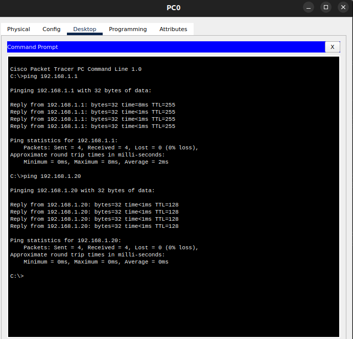
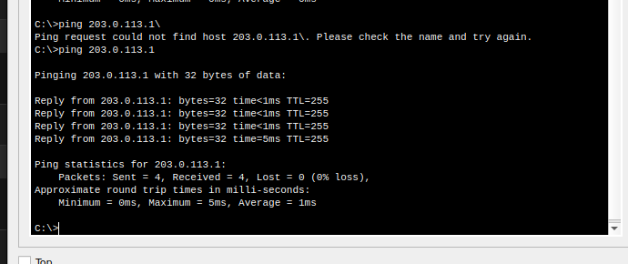
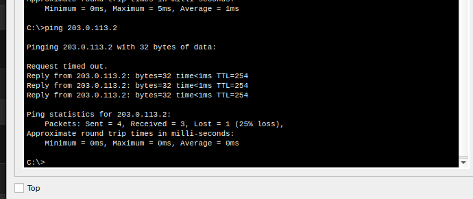
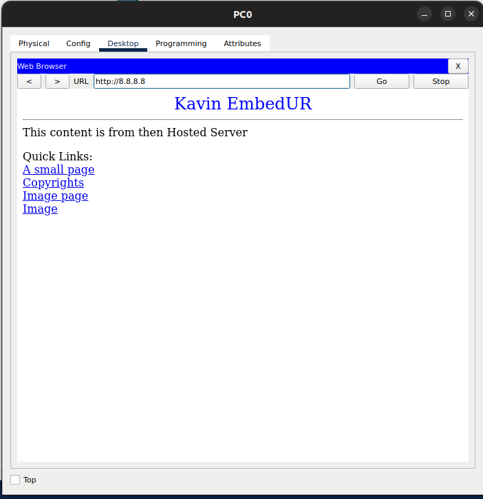
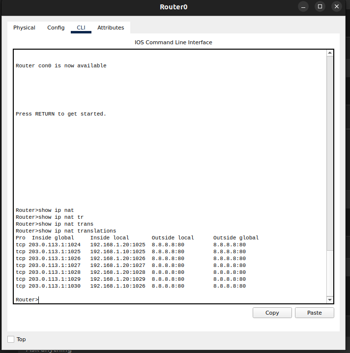

### In Cisco Packet Tracer, create a small network with multiple devices (e.g., 2 PCs and a router). Use private IP addresses (e.g., 192.168.1.x) on the PCs and configure the router to perform NAT to allow the PCs to access the internet.


- The topology that will be used for this is 



- here 
    - Router0 (Edge Router, doing NAT)
    - Router1 (ISP Router, simulating the Internet)
    - Server0 (Simulated Internet Server)
    - PC0 & PC1 (LAN Devices)
    - Switch0 (Connecting PCs to Router0)


- IP address of PC0 and PC1
    - PC1
        - IP: 192.168.1.10
        - Gateway: 192.168.1.1
    - PC2
        - IP; 192.168.1.20
        - Gateway: 192.168.1.1


- Now we configure Router0

```
enable
configure terminal

# LAN Interface (Connecting to PCs via Switch)
interface FastEthernet0/0
ip address 192.168.1.1 255.255.255.0
no shutdown
exit

# WAN Interface (Connecting to Router1, Public IP)
interface FastEthernet0/1
ip address 203.0.113.1 255.255.255.252
no shutdown
exit

# NAT Configuration
access-list 1 permit 192.168.1.0 0.0.0.255  # Allow LAN traffic for NAT
ip nat inside source list 1 interface FastEthernet0/1 overload  
# PAT for internet

# Define NAT inside and outside interfaces
interface FastEthernet0/0
ip nat inside
exit

interface FastEthernet0/1
ip nat outside
exit

# Default Route to Router1
ip route 0.0.0.0 0.0.0.0 203.0.113.2

end
write memory
```

- Similarly In the Router1 (ISP Router) we enter the following commands

```
enable
configure terminal

# Interface facing Router0 (WAN)
interface FastEthernet0/0
ip address 203.0.113.2 255.255.255.252
no shutdown
exit

# Interface facing Server0 (Simulated Internet)
interface FastEthernet0/1
ip address 8.8.8.1 255.255.255.0
no shutdown
exit

# Route back to private network
ip route 192.168.1.0 255.255.255.0 203.0.113.1

end
write memory
```
- for dynamic NAT

```bash

# access list creation
access-list 1 permit 192.168.1.0 0.0.0.255

# pool creation
ip nat pool DNAT 209.65.100.1 209.65.100.2 netmask 255.255.255.248

# nat inside mapping
int gigabitEthernet 0/0
ip nat inside
ex

# nat outside mapping
int f0/1
ip nat outside
ex

# pool mapping
ip nat inside source list 1 pool DNAT

# nat translation check
sh ip nat trans
```

- The results 

- As we can see we have local connectivity between PC and router



- We also have NAT and "internet" connectivity




- we are able to see the content hosted in our server too 


- To check that the NAT translations are happening properly

