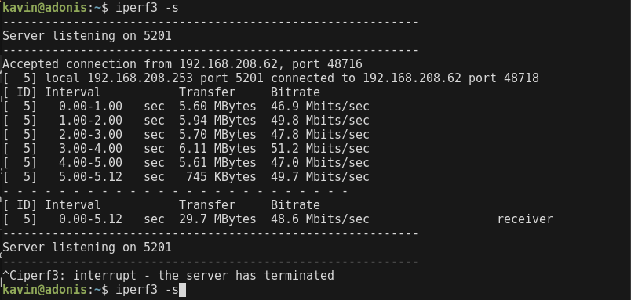
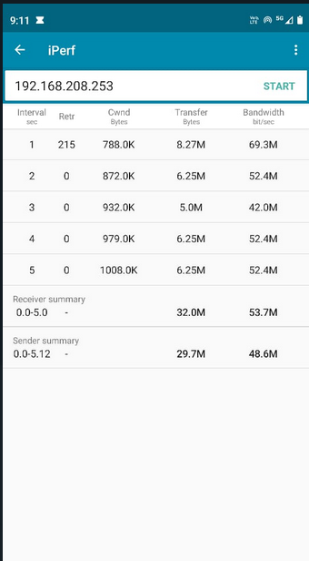
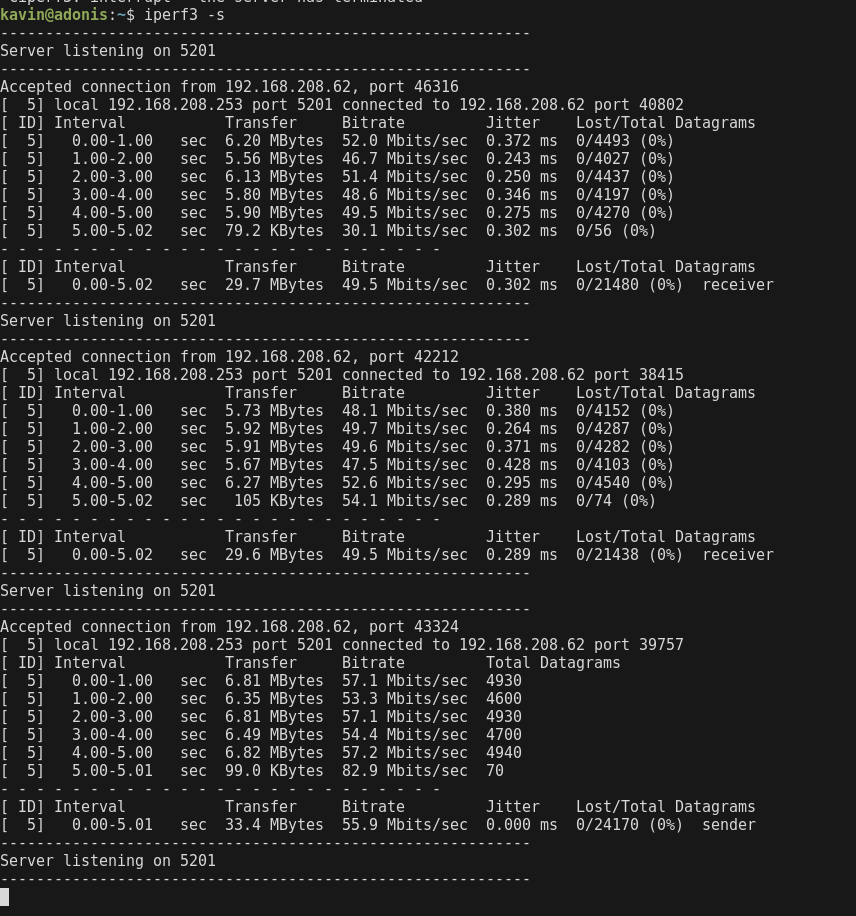
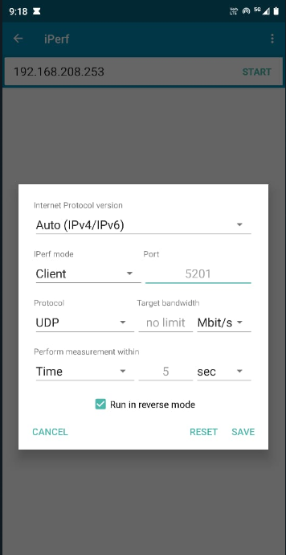

###  Download iperf in laptop/phone and make sure they are in same network. Try different iperf commands with tcp, udp, birectional, reverse, multicast, parallel options and analyze the bandwidth and rate of transmission, delay, jitter etc.

