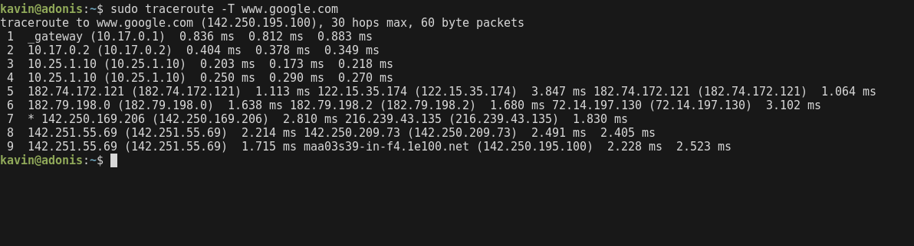

### Explore traceroute/tracert for different websites eg:google.com and analyse the parameters in the output and explore different options for traceroute command

` sudo traceroute www.google.com `

- Use TCP mode:

` sudo traceroute -T www.google.com` 

- To limit the max hops:

` traceroute -m 15 www.google.com`