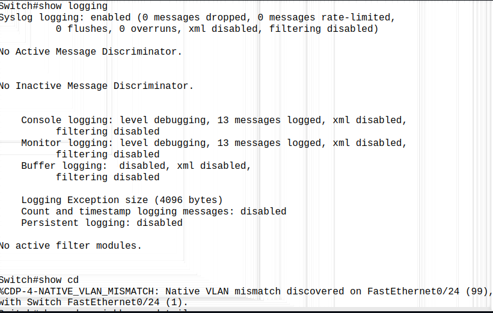
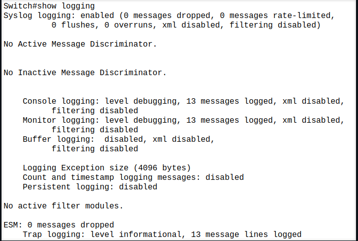

### Change the native VLAN on a trunk port. Test for VLAN mismatches and troubleshoot.

- Mismatched Native VLAN on a trunk port (VLAN 99 in switch 1 and VLAN 1 in switch 2)

- Correct Native VLAN on a trunk port (VLAN 99 on both)

