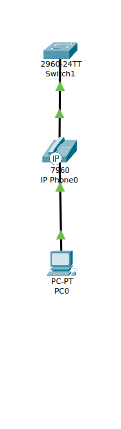

### You have a Cisco switch and a VoIP phone that needs to be placed in a voice VLAN (VLAN 20). The data for the PC should remain in a separate VLAN (VLAN 10). Configure the switch port to support both voice and data traffic.

- Topology



- Switch Configurations

```bash
Switch>
Switch>
Switch>en
Switch#conf t
Enter configuration commands, one per line.  End with CNTL/Z.
Switch(config)#vlan 10
Switch(config-vlan)#exit
Switch(config)#int f0/1
Switch(config-if)#sw
Switch(config-if)#switchport m
Switch(config-if)#switchport mode ac
Switch(config-if)#switchport mode access 
Switch(config-if)#sw
Switch(config-if)#switchport ac
Switch(config-if)#switchport access vlan 10
Switch(config-if)#exit
Switch(config)#vlan 20
Switch(config-vlan)#exit
Switch(config)#switchport mode access 
                ^
% Invalid input detected at '^' marker.
	
Switch(config)#int f0/1
Switch(config-if)#switchport mode access 
Switch(config-if)#switchport access vlan 20
Switch(config-if)#sp
Switch(config-if)#spann
Switch(config-if)#spanning-tree por
Switch(config-if)#spanning-tree portfast 
%Warning: portfast should only be enabled on ports connected to a single
host. Connecting hubs, concentrators, switches, bridges, etc... to this
interface  when portfast is enabled, can cause temporary bridging loops.
Use with CAUTION

%Portfast has been configured on FastEthernet0/1 but will only
have effect when the interface is in a non-trunking mode.
Switch(config-if)#exit
Switch(config)#en
Switch(config)#end
Switch(config)#end 
Switch#
%SYS-5-CONFIG_I: Configured from console by console

Switch#write mem
Switch#write memory 
Building configuration...
[OK]
Switch#
%LINEPROTO-5-UPDOWN: Line protocol on Interface FastEthernet0/1, changed state to up
%SPANTREE-2-RECV_PVID_ERR: Received 802.1Q BPDU on non trunk FastEthernet0/1 VLAN1.

%SPANTREE-2-BLOCK_PVID_LOCAL: Blocking FastEthernet0/1 on VLAN0001. Inconsistent port type.


Switch#
Switch#
```