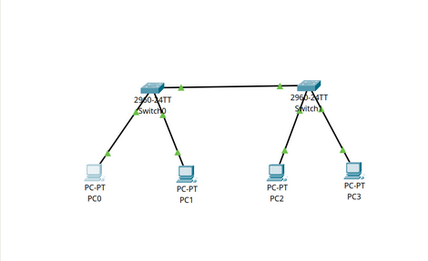
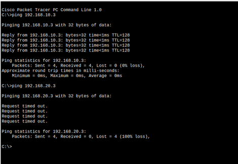
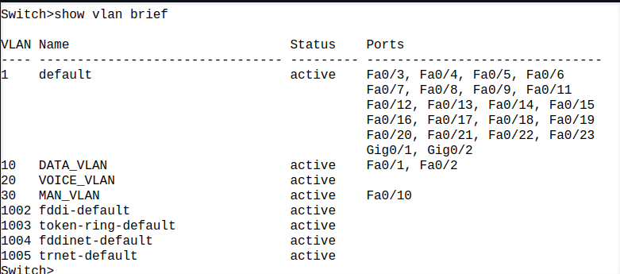
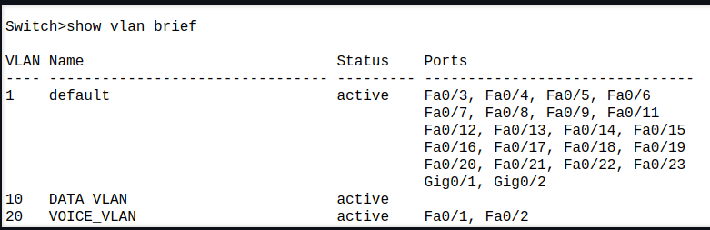
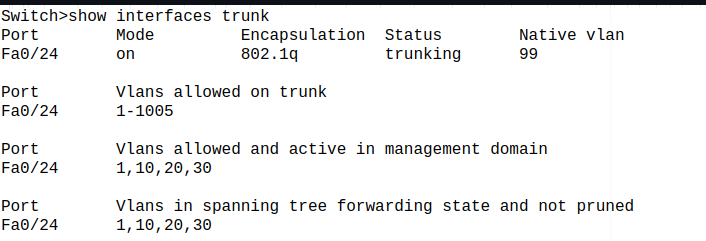

### You configured VLANs 10 and 20 on your switch and assigned ports to each VLAN. However, devices in VLAN 10 cannot communicate with devices in VLAN 20. Troubleshoot the issue.

- The topology

- ping test b/w the vlans

- VLAN configuration in switch 1

- VlAN configuration in switch 2

- Trunk Interface Configuration

