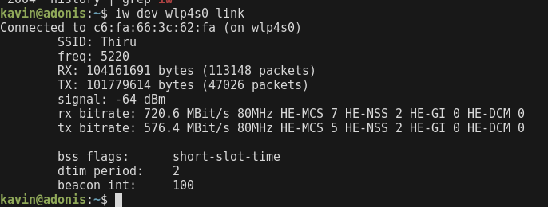

## Can you share the Wi-Fi devices that you are using day to day life, share that device's wireless capability/properties after connecting to network. Match your device to corresponding Wi-Fi Generations based on properties

- Common Wi-Fi devices include smartphones, laptops, tablets, smart TVs, and IoT devices.

- Wi-Fi 6 (802.11ax) – Since the router is using HE (High Efficiency) MCS rates and 80 MHz channel width, this confirms that the device supports Wi-Fi 6.