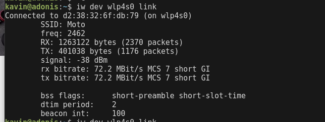
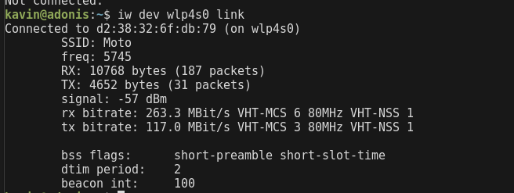

## Configure your modem/hotspot to operate only in 2.4Ghz and connect your laptop/Wi-Fi device, and capture the capability/properties in your Wi-Fi device. Repeat the same in 5Ghz and tabulate all the differences you observed during this tabulate all the differences you observed during this

- Network details when the mobile hotspot was at 2.4GHz

- Network details when the mobile hotspot was at 5GHz

- We can also see that 5Ghz provides better speed than 2.4Ghz