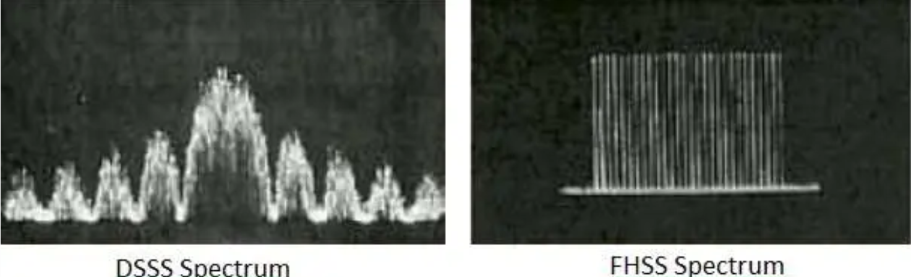

# 802.11 PHY Layer Overview and Wi-Fi Transmission Concepts

## 1. Different 802.11 PHY Layer Standards and Their Characteristics

| Standard  | Frequency | Max Data Rate | Modulation           | Bandwidth | Year | Notes                                   |
|-----------|-----------|---------------|-----------------------|-----------|------|-----------------------------------------|
| 802.11a   | 5 GHz     | 54 Mbps       | OFDM                  | 20 MHz    | 1999 | Less interference, shorter range        |
| 802.11b   | 2.4 GHz   | 11 Mbps       | DSSS                  | 22 MHz    | 1999 | Longer range, more interference         |
| 802.11g   | 2.4 GHz   | 54 Mbps       | OFDM + DSSS fallback  | 20 MHz    | 2003 | Backward compatible with b              |
| 802.11n   | 2.4/5 GHz | 600 Mbps      | OFDM + MIMO           | 20/40 MHz | 2009 | Introduced MIMO, optional SGI           |
| 802.11ac  | 5 GHz     | 6.93 Gbps     | OFDM + MU-MIMO        | 20-160 MHz| 2013 | Higher bandwidth and MIMO streams       |
| 802.11ax  | 2.4/5 GHz | 9.6 Gbps      | OFDMA + MU-MIMO       | 20-160 MHz| 2019 | Better efficiency, dense environments   |

## 2. DSSS and FHSS

- **DSSS (Direct Sequence Spread Spectrum)**:
  - Spreads data by multiplying it with a pseudo-random noise code.
  - Uses the entire bandwidth, resistant to narrowband interference.
  - Used in 802.11b.

- **FHSS (Frequency Hopping Spread Spectrum)**:
  - Transmits by hopping rapidly between frequencies.
  - More resistant to frequency interference, but less data rate.
  - Used in early 802.11 but phased out in favor of DSSS and OFDM.
  

## 3. Modulation Schemes in PHY Layer

| Scheme   | Bits/Symbol | Used In     | Performance                  |
|----------|-------------|-------------|-------------------------------|
| BPSK     | 1           | 802.11b/n/ac| Very robust, low throughput  |
| QPSK     | 2           | All         | Better throughput            |
| 16-QAM   | 4           | 802.11a/g/n | Higher data rate             |
| 64-QAM   | 6           | 802.11n/ac  | Needs high SNR               |
| 256-QAM  | 8           | 802.11ac    | High data rates, high SNR    |
| 1024-QAM | 10          | 802.11ax    | Maximum data rate, very high SNR required |

## 4. Significance of OFDM in WLAN

- **OFDM (Orthogonal Frequency Division Multiplexing)**:
  - Splits the channel into multiple orthogonal sub-carriers.
  - Each subcarrier carries part of the data in parallel.
  - Improves performance by reducing interference and increasing data throughput.
  - Used in 802.11a/g/n/ac/ax.

## 5. Frequency Bands and Channel Division

| Band     | Frequency Range | Channels     | Notes                         |
|----------|------------------|--------------|-------------------------------|
| 2.4 GHz  | 2.400 – 2.4835 GHz| 1 to 14      | Only 3 non-overlapping (1,6,11)|
| 5 GHz    | 5.150 – 5.850 GHz | 36 to 165    | More channels, less congestion|
| 6 GHz    | 5.925 – 7.125 GHz | 1 to 233     | Wi-Fi 6E, very high capacity  |

## 6. Guard Intervals in WLAN

- **Guard Interval (GI)** prevents inter-symbol interference.
- **Standard GI**: 800 ns  
- **Short GI (SGI)**: 400 ns — increases throughput (~10% improvement).
- SGI is used when the environment has minimal multipath effects.

## 7. Structure of 802.11 PHY Layer Frame

- **Preamble**: Synchronization, training symbols
- **PLCP Header**: Contains rate, length, etc.
- **Payload (PSDU)**: Actual MAC frame data

General format:
```
[ Preamble | PLCP Header | PSDU (MAC Frame) ]
```

## 8. Difference Between OFDM and OFDMA

| Feature     | OFDM                    | OFDMA                                  |
|-------------|-------------------------|----------------------------------------|
| Subcarriers | All used by one user    | Subcarriers divided among users        |
| Latency     | Higher                  | Lower, supports multiple users         |
| Used In     | 802.11a/g/n/ac          | 802.11ax (Wi-Fi 6)                     |

## 9. Difference Between MIMO and MU-MIMO

- **MIMO (Multiple Input Multiple Output)**:
  - Multiple antennas on AP and client.
  - One user gets multiple data streams.

- **MU-MIMO (Multi-User MIMO)**:
  - AP sends streams to multiple clients simultaneously.
  - Improves overall network efficiency.

## 10. PPDU, PLCP, and PMD in PHY Layer

- **PPDU (PLCP Protocol Data Unit)**: Transmitted over air, contains PLCP + PSDU.
- **PLCP (Physical Layer Convergence Protocol)**: Adapts MAC frame to PHY.
- **PMD (Physical Medium Dependent)**: Handles modulation and transmission.

## 11. Types of PPDU and Formats

| Wi-Fi Standard | PPDU Format       | Notes                                   |
|----------------|-------------------|-----------------------------------------|
| 802.11a/g      | OFDM PPDU         | Fixed structure                          |
| 802.11b        | DSSS/CCK PPDU     | Simple header                           |
| 802.11n        | HT PPDU           | HT-SIG fields, supports MIMO            |
| 802.11ac       | VHT PPDU          | Adds VHT-SIG A/B, high throughput       |
| 802.11ax       | HE PPDU           | Supports OFDMA, BSS coloring, etc.      |


    HT- Mixed - High Throughput
    VHT - Very High Throughput
    HE SU - High Efficiency Single User
    HE MU - High Efficiency Multiple User
    EHT SU - Extremely High Throughput Single User
    EHT MU - Extremely High Throughput Multiple User


## 12. Data Rate Calculation

Data Rate depends on:
```
Data Rate = (Number of Subcarriers) × (Bits per Symbol) × (Symbol Rate) × (Coding Rate) × (Number of Spatial Streams)
```

---
